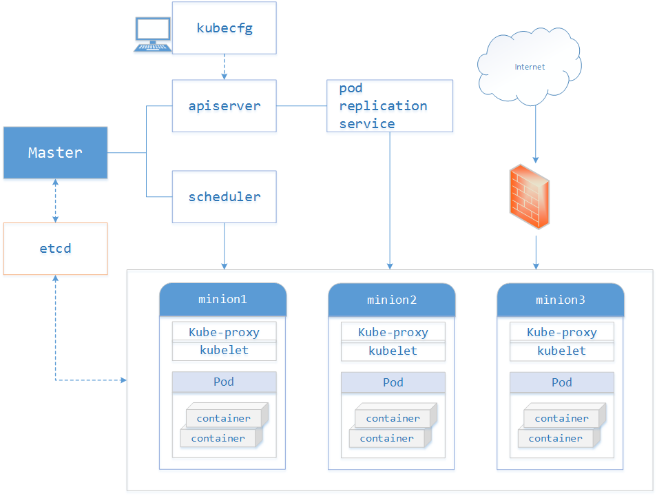

# 1. K8S重要概念#
[http://omerio.com/2015/12/18/learn-the-kubernetes-key-concepts-in-10-minutes/](http://omerio.com/2015/12/18/learn-the-kubernetes-key-concepts-in-10-minutes/)

## 1.1 什么是Kubernetes？##
Kubernetes（k8s）是自动化容器操作的开源平台，这些操作包括部署，调度和节点集群间扩展。如果你曾经用过Docker容器技术部署容器，那么可以将Docker看成Kubernetes内部使用的低级别组件。Kubernetes不仅仅支持Docker，还支持Rocket，这是另一种容器技术。
使用Kubernetes可以：

- 自动化容器的部署和复制
- 随时扩展或收缩容器规模
- 将容器组织成组，并且提供容器间的负载均衡
- 很容易地升级应用程序容器的新版本
- 提供容器弹性，如果容器失效就替换它，等等...

下图是官方给出的完整的架构图：

实际上，使用Kubernetes只需一个部署文件，使用一条命令就可以部署多层容器（前端，后台等）的完整集群：

	$ kubectl create -f single-config-file.yaml

kubectl是和Kubernetes API交互的命令行程序。现在介绍一些核心概念。

## 1.2 Kubernetes主要概念 ##

###1.2.1 集群 Cluster

集群是一组节点，这些节点可以是物理服务器或者虚拟机，之上安装了Kubernetes平台。下图展示这样的集群。注意该图为了强调核心概念有所简化。这里可以看到一个典型的Kubernetes架构图。

图1-1 Kubernetes Cluster

上图可以看到如下组件，使用特别的图标表示Service和Label：

- Pod
- Container（容器）
- Label()（标签）
- Replication Controller（复制控制器）
- Service（）（服务）
- Node（节点）
- Kubernetes Master（Kubernetes主节点）

### 1.2.2 Pod ### 

Pod（上图绿色方框）安排在节点上，包含一组容器和卷。同一个Pod里的容器共享同一个网络命名空间，可以使用localhost互相通信。Pod是短暂的，不是持续性实体。你可能会有这些问题：

- 如果Pod是短暂的，那么我怎么才能持久化容器数据使其能够跨重启而存在呢？ 是的，Kubernetes支持卷的概念，因此可以使用持久化的卷类型。
- 是否手动创建Pod，如果想要创建同一个容器的多份拷贝，需要一个个分别创建出来么？可以手动创建单个Pod，但是也可以使用Replication Controller使用Pod模板创建出多份拷贝，下文会详细介绍。
- 如果Pod是短暂的，那么重启时IP地址可能会改变，那么怎么才能从前端容器正确可靠地指向后台容器呢？这时可以使用Service，下文会详细介绍。

### 1.2.3 Lable 

正如图所示，一些Pod有Label（）。一个Label是attach到Pod的一对键/值对，用来传递用户定义的属性。比如，你可能创建了一个"tier"和“app”标签，通过Label（tier=frontend, app=myapp）来标记前端Pod容器，使用Label（tier=backend, app=myapp）标记后台Pod。然后可以使用Selectors选择带有特定Label的Pod，并且将Service或者Replication Controller应用到上面。

### 1.2.4 Replication Controller 

是否手动创建Pod，如果想要创建同一个容器的多份拷贝，需要一个个分别创建出来么，能否将Pods划到逻辑组里？

当创建Replication Controller时，需要指定两个东西：

- Pod模板：用来创建Pod副本的模板
- Label：Replication Controller需要监控的Pod的标签。

Replication Controller使用预先定义的pod模板创建pods，一旦创建成功，pod 模板和创建的pods没有任何关联，可以修改 pod 模板而不会对已创建pods有任何影响，也可以直接更新通过Replication Controller创建的pods。对于利用 pod 模板创建的pods，Replication Controller根据 label selector 来关联，通过修改pods的label可以删除对应的pods。Replication Controller主要有如下用法：

- **Rescheduling**: 如上所述，Replication Controller会确保Kubernetes集群中指定的pod副本(replicas)在运行， 即使在节点出错时。
- **Scaling**: 通过修改Replication Controller的副本(replicas)数量来水平扩展或者缩小运行的pods。
- **Rolling** updates:Replication Controller的设计原则使得可以一个一个地替换pods来滚动更新（rolling updates）服务。
- **Multiple release tracks**: 如果需要在系统中运行multiple release的服务，Replication Controller使用labels来区分multiple release tracks。

Replication Controller确保任意时间都有指定数量的Pod“副本”在运行。如果为某个Pod创建了Replication Controller并且指定3个副本，它会创建3个Pod，并且持续监控它们。如果某个Pod不响应，那么Replication Controller会替换它，保持总数为3.如下面的动画所示：

如果之前不响应的Pod恢复了，现在就有4个Pod了，那么Replication Controller会将其中一个终止保持总数为3。如果在运行中将副本总数改为5，Replication Controller会立刻启动2个新Pod，保证总数为5。还可以按照这样的方式缩小Pod，这个特性在执行滚动升级(rolling update)时很有用。

现在已经创建了Pod的一些副本，那么在这些副本上如何均衡负载呢？我们需要的是Service。

### 1.2.5 Service 

如果Pods是短暂的，那么重启时IP地址可能会改变，怎么才能从前端容器正确可靠地指向后台容器呢？

Service是定义一系列Pod以及访问这些Pod的策略的一层抽象。Service通过Label找到Pod组。因为Service是抽象的，所以在图表里通常看不到它们的存在，这也就让这一概念更难以理解。

现在，假定有2个后台Pod，并且定义后台Service的名称为‘backend-service’，lable选择器为（tier=backend, app=myapp）。backend-service 的Service会完成如下两件重要的事情：
会为Service创建一个本地集群的DNS入口，因此前端Pod只需要DNS查找主机名为 ‘backend-service’，就能够解析出前端应用程序可用的IP地址。
现在前端已经得到了后台服务的IP地址，但是它应该访问2个后台Pod的哪一个呢？Service在这2个后台Pod之间提供透明的负载均衡，会将请求分发给其中的任意一个（如下面的动画所示）。通过每个Node上运行的代理（kube-proxy）完成。这里有更多技术细节。

下述动画展示了Service的功能。注意该图作了很多简化。如果不进入网络配置，那么达到透明的负载均衡目标所涉及的底层网络和路由相对先进。如果有兴趣，这里有更深入的介绍。

有一个特别类型的Kubernetes Service，称为'LoadBalancer'，作为外部负载均衡器使用，在一定数量的Pod之间均衡流量。比如，对于负载均衡Web流量很有用。

## 1.3 Kubernetes构件 ##
Kubenetes整体框架如下图，主要包括kubecfg、Master API Server、Kubelet、Minion(Host)以及Proxy。

### 1.3.1 Master ###

Master定义了Kubernetes 集群Master/API Server的主要声明，包括Pod Registry、Controller Registry、Service Registry、Endpoint Registry、Minion Registry、Binding Registry、RESTStorage以及Client, 是client(Kubecfg)调用Kubernetes API，管理Kubernetes主要构件Pods、Services、Minions、容器的入口。Master由API Server、Scheduler以及Registry等组成。从下图可知Master的工作流主要分以下步骤：

- Kubecfg将特定的请求，比如创建Pod，发送给Kubernetes Client。
- Kubernetes Client将请求发送给API server。
- API Server根据请求的类型，比如创建Pod时storage类型是pods，然后依此选择何种REST Storage API对请求作出处理
- REST Storage API对的请求作相应的处理。
- 将处理的结果存入高可用键值存储系统Etcd中。
- 在API Server响应Kubecfg的请求后，Scheduler会根据Kubernetes Client获取集群中运行Pod及Minion信息。
- 依据从Kubernetes Client获取的信息，Scheduler将未分发的Pod分发到可用的Minion节点上。

下面是Master的主要构件的详细介绍。

#### 1.3.1.1 Minion Registry ####

Minion Registry负责跟踪Kubernetes 集群中有多少Minion(Host)。Kubernetes封装Minion Registry成实现Kubernetes API Server的RESTful API接口REST，通过这些API，我们可以对Minion Registry做Create、Get、List、Delete操作，由于Minon只能被创建或删除，所以不支持Update操作，并把Minion的相关配置信息存储到etcd。除此之外，Scheduler算法根据Minion的资源容量来确定是否将新建Pod分发到该Minion节点。

可以通过`curl http://{master-apiserver-ip}:4001/v2/keys/registry/minions/`来验证etcd中存储的内容。

#### 1.3.1.2 Pod Registry ####

Pod Registry负责跟踪Kubernetes集群中有多少Pod在运行，以及这些Pod跟Minion是如何的映射关系。将Pod Registry和Cloud Provider信息及其他相关信息封装成实现Kubernetes API Server的RESTful API接口REST。通过这些API，我们可以对Pod进行Create、Get、List、Update、Delete操作，并将Pod的信息存储到etcd中，而且可以通过Watch接口监视Pod的变化情况，比如一个Pod被新建、删除或者更新。

#### 1.3.1.3 Service Registry ####

Service Registry负责跟踪Kubernetes集群中运行的所有服务。根据提供的Cloud Provider及Minion Registry信息把Service Registry封装成实现Kubernetes API Server需要的RESTful API接口REST。利用这些接口，我们可以对Service进行Create、Get、List、Update、Delete操作，以及监视Service变化情况的watch操作，并把Service信息存储到etcd。

#### 1.3.1.4 Controller Registry ####

Controller Registry负责跟踪Kubernetes集群中所有的Replication Controller，Replication Controller维护着指定数量的pod 副本(replicas)拷贝，如果其中的一个容器死掉，Replication Controller会自动启动一个新的容器，如果死掉的容器恢复，其会杀死多出的容器以保证指定的拷贝不变。通过封装Controller Registry为实现Kubernetes API Server的RESTful API接口REST， 利用这些接口，我们可以对Replication Controller进行Create、Get、List、Update、Delete操作，以及监视Replication Controller变化情况的watch操作，并把Replication Controller信息存储到etcd。

#### 1.3.1.5 Endpoints Registry ####

Endpoints Registry负责收集Service的endpoint，比如Name：”mysql”，Endpoints: [“10.10.1.1:1909”，”10.10.2.2:8834”]，同Pod Registry，Controller Registry也实现了Kubernetes API Server的RESTful API接口，可以做Create、Get、List、Update、Delete以及watch操作。

#### 1.3.1.6 Binding Registry ####

Binding包括一个需要绑定Pod的ID和Pod被绑定的Host，Scheduler写Binding Registry后，需绑定的Pod被绑定到一个host。Binding Registry也实现了Kubernetes API Server的RESTful API接口，但Binding Registry是一个write-only对象，所有只有Create操作可以使用， 否则会引起错误。

#### 1.3.1.7 Scheduler ####

Scheduler收集和分析当前Kubernetes集群中所有Minion节点的资源(内存、CPU)负载情况，然后依此分发新建的Pod到Kubernetes集群中可用的节点。由于一旦Minion节点的资源被分配给Pod，那这些资源就不能再分配给其他Pod， 除非这些Pod被删除或者退出， 因此，Kubernetes需要分析集群中所有Minion的资源使用情况，保证分发的工作负载不会超出当前该Minion节点的可用资源范围。具体来说，Scheduler做以下工作：

- 实时监测Kubernetes集群中未分发的Pod。
- 实时监测Kubernetes集群中所有运行的Pod，Scheduler需要根据这些Pod的资源状况安全地将未分发的Pod分发到指定的Minion节点上。
- Scheduler也监测Minion节点信息，由于会频繁查找Minion节点，Scheduler会缓存一份最新的信息在本地。
- 最后，Scheduler在分发Pod到指定的Minion节点后，会把Pod相关的信息Binding写回API Server。

### 1.3.2 Kubelet ###

根据上图可知Kubelet是Kubernetes集群中每个Minion和Master API Server的连接点，Kubelet运行在每个Minion上，是Master API Server和Minion之间的桥梁，接收Master API Server分配给它的commands和work，与持久性键值存储etcd、file、server和http进行交互，读取配置信息。Kubelet的主要工作是管理Pod和容器的生命周期，其包括Docker Client、Root Directory、Pod Workers、Etcd Client、Cadvisor Client以及Health Checker组件，具体工作如下：

- 通过Worker给Pod异步运行特定的Action
- 设置容器的环境变量
- 给容器绑定Volume
- 给容器绑定Port
- 根据指定的Pod运行一个单一容器
- 杀死容器
- 给指定的Pod创建network 容器
- 删除Pod的所有容器
- 同步Pod的状态
- 从cAdvisor获取container info、 pod info、 root info、 machine info
- 检测Pod的容器健康状态信息
- 在容器中运行命令

### 1.3.3 Proxy ###

Proxy是为了解决外部网络能够访问跨机器集群中容器提供的应用服务而设计的，运行在每个Minion上。Proxy提供TCP/UDP sockets的proxy，每创建一种Service，Proxy主要从etcd获取Services和Endpoints的配置信息（也可以从file获取），然后根据配置信息在Minion上启动一个Proxy的进程并监听相应的服务端口，当外部请求发生时，Proxy会根据Load Balancer将请求分发到后端正确的容器处理。

所以Proxy不但解决了同一主宿机相同服务端口冲突的问题，还提供了Service转发服务端口对外提供服务的能力，Proxy后端使用了随机、轮循负载均衡算法。

每个代理节点都运行了一个kube-proxy进程。这个进程从服务进程那边拿到Service和Endpoint对象的变化。 对每一个Service, 它在本地打开一个端口。 到这个端口的任意连接都会代理到后端Pod集合中的一个Pod IP和端口。在创建了服务后，服务Endpoint模型会体现后端Pod的IP和端口列表，kube-proxy就是从这个endpoint维护的列表中选择服务后端的。另外Service对象的sessionAffinity属性也会帮助kube-proxy来选择哪个具体的后端。缺省情况下，后端Pod的选择是随机的。可以设置service.spec.sessionAffinity 成"ClientIP"来指定同一个ClientIP的流量代理到同一个后端。在实现上，kube-proxy会用IPtables规则把访问Service的Cluster IP和端口的流量重定向到这个本地端口。

当Service被创建时，Kubernetes给它分配一个地址10.0.0.1。这个地址从我们启动API的service-cluster-ip-range参数(旧版本为portal_net参数)指定的地址池中分配，比如--service-cluster-ip-range=10.0.0.0/16。假设这个Service的端口是1234。集群内的所有kube-proxy都会注意到这个Service。当proxy发现一个新的service后，它会在本地节点打开一个任意端口，建相应的iptables规则，重定向服务的IP和port到这个新建的端口，开始接受到达这个服务的连接。

客户端访问Service流程下图所示，当一个客户端访问这个service时，这些iptable规则就开始起作用，客户端的流量被重定向到kube-proxy为这个service打开的端口上，kube-proxy随机选择一个后端pod来服务客户。

  

**1. 内部使用者的服务发现**

Kubernetes在一个集群内创建的对象或者在代理集群节点上发出访问的客户端我们称之为**内部使用者**。要把服务暴露给内部使用者，Kubernetes支持两种方式：环境变量和DNS。

- **环境变量**:当kubelet在某个节点上启动一个Pod时，它会给这个Pod的容器为当前运行的Service设置一系列环境变量，这样Pod就可以访问这些Service了。**注意，只有在某个Service后创建的Pod才会有这个Service的环境变量。**
> 一般地，环境变量设置为{SVCNAME}_SERVICE_HOST和{SVCNAME}_SERVICE_PORT变量, 其中{SVCNAME}是Service名字变成大写，中划线变成下划线。比如Service "redis-master"，它的端口是 TCP  6379，分配到的Cluster IP地址是 10.0.0.11，kubelet可能会产生下面的变量给新创建的Pod容器：

		REDIS_MASTER_SERVICE_HOST= 10.0.0.11
		REDIS_MASTER_SERVICE_PORT=6379
		REDIS_MASTER_PORT=tcp://10.0.0.11:6379
		REDIS_MASTER_PORT_6379_TCP=tcp://10.0.0.11:6379
		REDIS_MASTER_PORT_6379_TCP_PROTO=tcp
		REDIS_MASTER_PORT_6379_TCP_PORT=6379
		REDIS_MASTER_PORT_6379_TCP_ADDR= 10.0.0.11

- **DNS**：一个可选的Kubernetes附件（强烈建议用户使用）是DNS服务。它跟踪集群中Service对象，为每个Service对象创建DNS记录。这样所有的Pod就可以通过DNS访问服务了。
> 比如说我们在Kubernetes 名字空间"my-ns"中有个叫my-service的服务，DNS服务会创建一条"my-service.my-ns"的DNS记录。同在这个命名空间的Pod就可以通过"my-service"来得到这个Service分配到的Cluster IP，在其它命名空间的Pod则可以用全限定名"my-service.my-ns"来获得这个Service的地址。

**2. 外部访问Service**
  
For some parts of your application (e.g. frontends) you may want to expose a Service onto an external (outside of your cluster, maybe public internet) IP address, other services should be visible only from inside of the cluster.

Kubernetes ServiceTypes allow you to specify what kind of service you want. The default and base type is ClusterIP, which exposes a service to connection from inside the cluster. **NodePort** and **LoadBalancer** are two types that expose services to external traffic.

Valid values for the ServiceType field are:

- **ClusterIP:** use a cluster-internal IP only - this is the default and is discussed above. Choosing this value means that you want this service to be reachable only from inside of the cluster.
- **NodePort:** on top of having a cluster-internal IP, expose the service on a port on each node of the cluster (the same port on each node). You’ll be able to contact the service on any <NodeIP>:NodePort address.
- **LoadBalancer:** on top of having a cluster-internal IP and exposing service on a NodePort also, ask the cloud provider for a load balancer which forwards to the Service exposed as a <NodeIP>:NodePort for each Node.

- **Type NodePort**

If you set the type field to "NodePort", the Kubernetes master will allocate a port from a flag-configured range (default: 30000-32767), and each Node will proxy that port (the same port number on every Node) into your Service. That port will be reported in your Service’s spec.ports[*].nodePort field.

If you want a specific port number, you can specify a value in the nodePort field, and the system will allocate you that port or else the API transaction will fail (i.e. you need to take care about possible port collisions yourself). The value you specify must be in the configured range for node ports.

This gives developers the freedom to set up their own load balancers, to configure cloud environments that are not fully supported by Kubernetes, or even to just expose one or more nodes’ IPs directly.

Note that this Service will be visible as both <NodeIP>:spec.ports[*].nodePort and spec.clusterIp:spec.ports[*].port.

- **Type LoadBalancer**

On cloud providers which support external load balancers, setting the type field to "LoadBalancer" will provision a load balancer for your Service. The actual creation of the load balancer happens asynchronously, and information about the provisioned balancer will be published in the Service’s status.loadBalancer field. For example:

	{
    	"kind": "Service",
	    "apiVersion": "v1",
	    "metadata": {
	        "name": "my-service"
		    },
	    "spec": {
	        "selector": {
            "app": "MyApp"
        	},
        	"ports": [
            	{
               	 	"protocol": "TCP",
               	 	"port": 80,
               	 	"targetPort": 9376,
                	"nodePort": 30061
            	}
        	],
        	"clusterIP": "10.0.171.239",
        	"loadBalancerIP": "78.11.24.19",
        	"type": "LoadBalancer"
    	},
    	"status": {
        	"loadBalancer": {
            	"ingress": [
                	{
                    	"ip": "146.148.47.155"
                	}
            	]
        	}
    	}
	}
Traffic from the external load balancer will be directed at the backend Pods, though exactly how that works depends on the cloud provider. Some cloud providers allow the loadBalancerIP to be specified. In those cases, the load-balancer will be created with the user-specified loadBalancerIP. If the loadBalancerIP field is not specified, an ephemeral IP will be assigned to the loadBalancer. If the loadBalancerIP is specified, but the cloud provider does not support the feature, the field will be ignored.

## 1.4 Kubernetes工作流程图 ##

