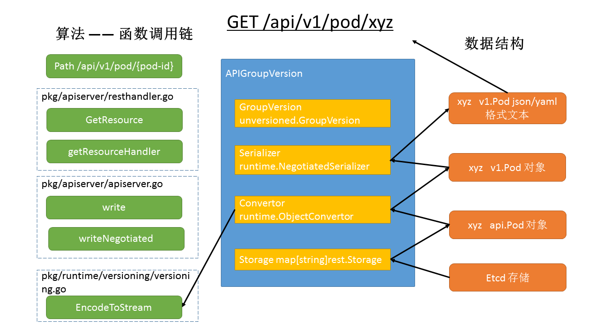

# 5 Kube-apiserver Store #

## 5.1 Kube-APIServer etcd注册的操作 ##

APIServer采用REST框架，可以实现http请求 -> restful.Route -> rest.Storage。然而rest.Storage仅仅是一个接口，有何德何能，可以真正的操作etcd呢？

首先，APIserver需要对所有的对象都执行增删改查这些操作，如果为Pod单独搞一套，Controller单独搞一套，那代码会非常重复，不可复用。kubernetes将这些可以复用的存储相关的代码存储在文件store.go（原etcd.go）中：
	
	kubernetes/pkg/registry/generic/registry/store.go

**最新版本的kubernetes源码文件中定义了Store struct，旨在兼容包括etcd在内的不同的存储方式？**

	type Store struct {
		// Called to make a new object, should return e.g., &api.Pod{}
		NewFunc func() runtime.Object

		// Called to make a new listing object, should return e.g., &api.PodList{}
		NewListFunc func() runtime.Object

		// Used for error reporting
	
		...	

		// Used for all storage access functions
		Storage storage.Interface
	}

`store.go`文件定了所有的对etcd对象的操作，get,list,create等，但不关心具体的对象（pod，node等）；亦不关心etcd客户端地址。这些信息都是在具体的PodStorage对象创建的时候注入的。以Pod为例子，文件在：

	/kubernetes/pkg/registry/pod/etcd/etcd.go

	// PodStorage includes storage for pods and all sub resources
	type PodStorage struct {
		Pod         *REST
		Binding     *BindingREST
		Status      *StatusREST
		Log         *podrest.LogREST
		Proxy       *podrest.ProxyREST
		Exec        *podrest.ExecREST
		Attach      *podrest.AttachREST
		PortForward *podrest.PortForwardREST
	}

`store.go`文件中的NewStorage方法，把上述的信息注入了etcd里面去，生成了PodStorage这个对象。

	// NewStorage returns a RESTStorage object that will work against pods.
	func NewStorage(opts generic.RESTOptions, k client.ConnectionInfoGetter, proxyTransport 
	http.RoundTripper) PodStorage {
		prefix := "/" + opts.ResourcePrefix

		store := &registry.Store{
			NewFunc:     func() runtime.Object { return &api.Pod{} },
			NewListFunc: newListFunc,
			KeyRootFunc: func(ctx api.Context) string {
				return registry.NamespaceKeyRootFunc(ctx, prefix)
			...
			ReturnDeletedObject: true,
	
			Storage: storageInterface,
		}
	
		statusStore := *store
		statusStore.UpdateStrategy = pod.StatusStrategy

		return PodStorage{
			Pod:         &REST{store, proxyTransport},
			Binding:     &BindingREST{store: store},
			Status:      &StatusREST{store: &statusStore},
			Log:         &podrest.LogREST{Store: store, KubeletConn: k},
			Proxy:       &podrest.ProxyREST{Store: store, ProxyTransport: proxyTransport},
			Exec:        &podrest.ExecREST{Store: store, KubeletConn: k},
			Attach:      &podrest.AttachREST{Store: store, KubeletConn: k},
			PortForward: &podrest.PortForwardREST{Store: store, KubeletConn: k},
		}

由于PodStorage.Pod是一个REST类型，而REST类型采用了Go语言的struct匿名内部成员，天然就拥有Get, List等方法。

	kubernetes/pkg/apiserver/api_installer.go

最后在这里把PodStorage转换成了Getter对象，并最终注册到ApiGroup里面去。

## 5.2 其它相关的ETCD操作 ##
。。。。