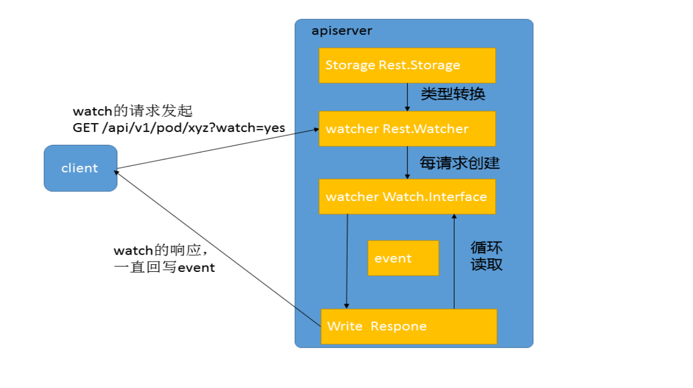
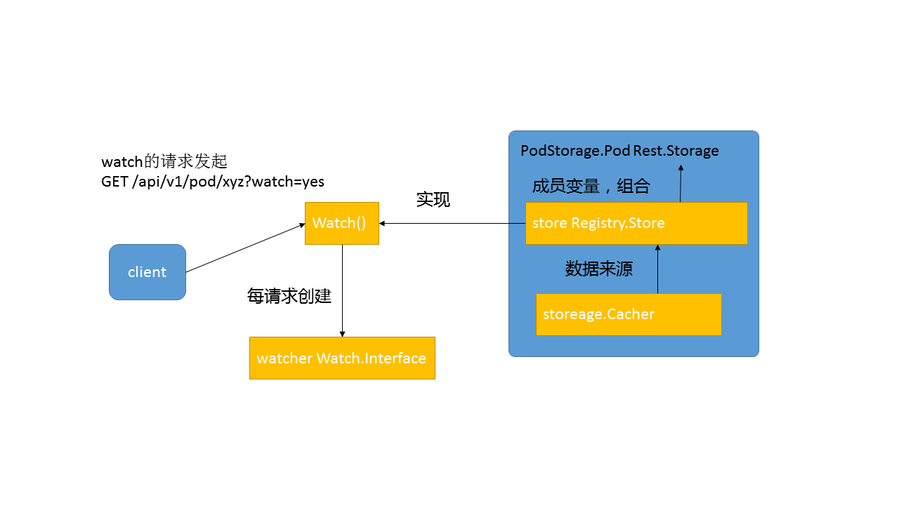
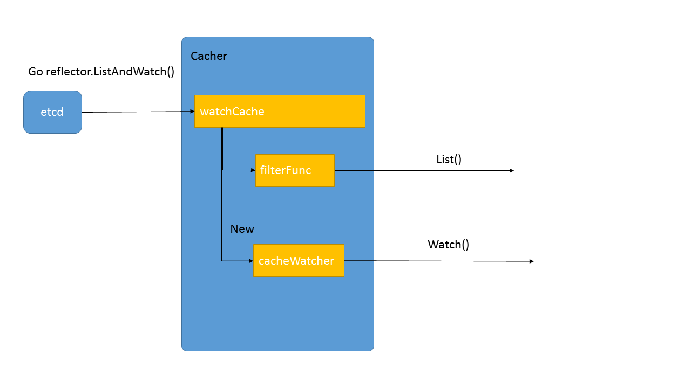
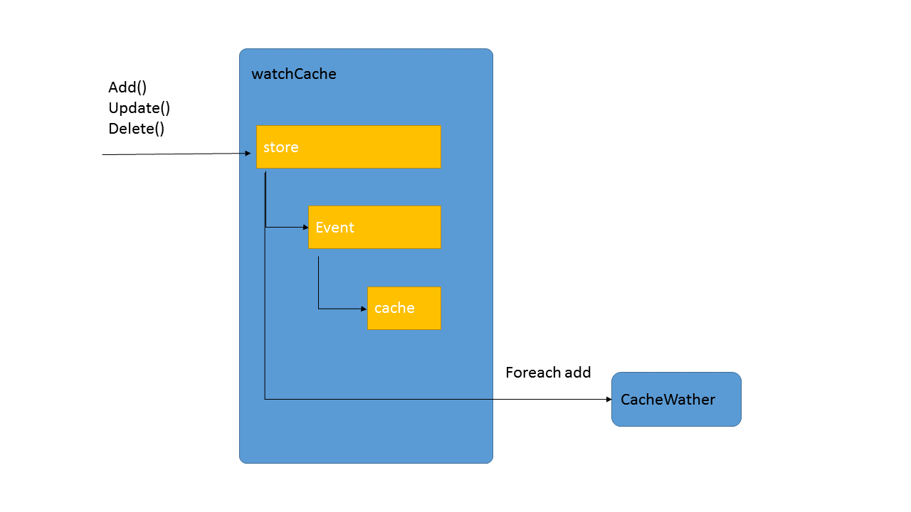

# 7. Kube-apiserver-List-Watch #
[http://dockone.io/article/1538](http://dockone.io/article/1538)  
list-watch，作为k8s系统中统一的异步消息传递方式，对系统的性能、数据一致性起到关键性的作用。本文从代码这边探究一下list-watch的实现方式。并看是否能在后面的工作中优化这个过程。

## 7.1 List-Watch 的需求 ##
  
图7-1 Pod创建过程中的List-Watch机制

上图7-1是一个典型的Pod创建过程，在这个过程中，每次当kubectl创建了ReplicaSet对象后，controller-manager都是通过list-watch这种方式得到了最新的ReplicaSet对象，并执行自己的逻辑来创建Pod对象。其他的几个组件，Scheduler/Kubelet也是一样，通过list-watch得知变化并进行处理。这是组件的处理端代码：

	go
	c.NodeLister.Store, c.nodePopulator = framework.NewInformer(
    	c.createNodeLW(),                                            ...(1)
    	&api.Node{},                                                 ...(2)
    	0,                                                           ...(3)
    	framework.ResourceEventHandlerFuncs{                         ...(4)
       		AddFunc:    c.addNodeToCache,                            ...(5)
        	UpdateFunc: c.updateNodeInCache,
        	DeleteFunc: c.deleteNodeFromCache,
    	},
	)  

其中(1)是list-watch函数，(4)(5)则是相应事件触发操作的入口。  

list-watch操作需要做这么几件事：

- 由组件向apiserver而不是etcd发起watch请求，在组件启动时就进行订阅，告诉apiserver需要知道什么数据发生变化。Watch是一个典型的发布-订阅模式。
- 组件向apiserver发起的watch请求是可以带条件的，例如，scheduler想要watch的是所有未被调度的Pod，也就是满足Pod.destNode=""的Pod来进行调度操作；而kubelet只关心自己节点上的Pod列表。apiserver向etcd发起的watch是没有条件的，只能知道某个数据发生了变化或创建、删除，但不能过滤具体的值。也就是说对象数据的条件过滤必须在apiserver端而不是etcd端完成。
- list是watch失败，数据太过陈旧后的弥补手段，这方面详见“基于list-watch的Kubernetes异步事件处理框架详解-客户端部分（未找到原文）”。list本身是一个简单的列表操作，和其它apiserver的增删改操作一样，不再多描述细节。

## 7.2 watch的API处理 ##

既然watch本身是一个apiserver提供的http restful的API，那么就按照API的方式去阅读它的代码：

**关键的处理API注册代码** `pkg/apiserver/api_installer.go`

	func (a *APIInstaller) registerResourceHandlers(path string, storage rest.Storage,...

	...
	lister, isLister := storage.(rest.Lister)
	watcher, isWatcher := storage.(rest.Watcher)                     ...(1)
	...    
    	case "LIST": // List all resources of a kind.                ...(2)
        	doc := "list objects of kind " + kind
        	if hasSubresource {
           		doc = "list " + subresource + " of objects of kind " + kind
        	}
        	handler := metrics.InstrumentRouteFunc(action.Verb, resource, ListResource(lister, watcher, reqScope, false, a.minRequestTimeout)) ...(3)  

- 一个rest.Storage对象会被转换为watcher和lister对象   
- 提供list和watch服务的入口是同一个，在API接口中是通过 GET /pods?watch=true 这种方式来区分是list还是watch
- API处理函数是由lister和watcher经过ListResource()合体后完成的。

那么就看看**ListResource()的具体实现**吧，`/pkg/apiserver/resthandler.go`

	func ListResource(r rest.Lister, rw rest.Watcher,... {
	...
    	if (opts.Watch || forceWatch) && rw != nil {
    	    watcher, err := rw.Watch(ctx, &opts)           ...(1)
    	    ....
    	    serveWatch(watcher, scope, req, res, timeout)
    	    return
    	}
    	result, err := r.List(ctx, &opts)                  ...(2)           
    	write(http.StatusOK, scope.Kind.GroupVersion(), scope.Serializer, result, w, req.Reques
		
- 每次有一个watch的url请求过来，都会调用rw.Watch()创建一个watcher，好吧这里的名字和上面那一层的名字重复了，但我们可以区分开，然后使用serveWatch()来处理这个请求。**watcher的生命周期是每个http请求的**，这一点非常重要。
- list在这里是另外一个分支，和watch分别处理，可以忽略。

**响应http请求的过程serveWatch()的代码在`/pkg/apiserver/watch.go`里面**

	func serveWatch(watcher watch.Interface... {
	server.ServeHTTP(res.ResponseWriter, req.Request)
	}

	func (s *WatchServer) ServeHTTP(w http.ResponseWriter, req *http.Request) {
	for {
    	select {
    	case event, ok := <-s.watching.ResultChan():
	
    	    obj := event.Object
	
    	    if err := s.embeddedEncoder.EncodeToStream(obj, buf); 
	...	
	}   

这段的操作基本毫无技术含量，就是从watcher的结果channel中读取一个event对象，然后持续不断的编码写入到http response的流当中。

整个过程的图形化描述如图7-2所示：  

图7-2 List-Watch 流程示意图

所以，我们的问题就回到了：

- watcher这个对象，严格来说是watch.Interface的对象，位置在pkg/watch/watch.go中，是怎么被创建出来的？
- 这个watcher对象是怎么从etcd中获得变化的数据的？又是怎么过滤条件的？

## 7.3 在代码迷宫中追寻watcher ##

回到上面的代码追踪过程来看，watcher(watch.Interface)对象是被Rest.Storage对象创建出来的。从上一篇“apiserver的基础功能实现”可以知道，所有的Rest.Storage分两层，一层是每个对象自己的逻辑，另一层则是通过通用的操作来搞定，像watch这样的操作应该是通用的，所以我们看这个源代码：

`/pkg/registry/generic/registry/store.go`

	func (e *Store) Watch(ctx api.Context, options *api.ListOptions) (watch.Interface, error) {
	...
	return e.WatchPredicate(ctx, e.PredicateFunc(label, field), resourceVersion)
	}

	func (e *Store) WatchPredicate(ctx api.Context, m generic.Matcher, resourceVersion string) (watch.Interface, error) {

    	    return e.Storage.Watch(ctx, key, resourceVersion, filterFunc)   ...(1)

	return e.Storage.WatchList(ctx, e.KeyRootFunc(ctx), resourceVersion, filterFunc)
	}  

果然，我们在(1)这里找到了生成Watch的函数，但这个工作是由e.Storage来完成的，所以我们需要找一个具体的Storage的生成过程，以Pod为例子
`/pkg/registry/pod/etcd/etcd.go`

	func NewStorage(opts generic.RESTOptions, k client.ConnectionInfoGetter, proxyTransport http.RoundTripper) PodStorage {
	prefix := "/" + opts.ResourcePrefix

	storageInterface := opts.Decorator(
    	opts.Storage, 
		cachesize.GetWatchCacheSizeByResource(cachesize.Pods), 
		&api.Pod{},
		prefix, 
		pod.Strategy,
	    newListFunc )                                        			  ...(1)

	store := &registry.Store{
    	...
    	Storage: storageInterface,                                        ...(2)
	}
	return PodStorage{
	    Pod:         &REST{store, proxyTransport},                        ...(3)  
	
这(1)就是Storage的生成现场，传入的参数包括了一个缓存Pod的数量。(2)(3)是和上面代码的连接点。那么现在问题就转化为追寻Decorator这个东西具体是怎么生成的，需要重复刚才的过程，往上搜索opts是怎么搞进来的。

- `/pkg/master/master.go - GetRESTOptionsOrDie()`
- `/pkg/genericapiserver/genericapiserver.go - StorageDecorator()`
- `/pkg/registry/generic/registry/storage_factory.go - StorageWithCacher()`
- `/pkg/storage/cacher.go`

OK，这样我们就来到正题，一个具体的watch缓存的实现了！

把上面这个过程用一幅图（图7-3）表示：
  
图7-3 Watch 缓存实现

## 7.4. watch缓存的具体实现 ##

看代码，首要看的是数据结构，**以及考虑这个数据结构和需要解决的问题之间的关系**。
### 7.4.1 Cacher(`pkg/storage/cacher.go`) ###

对于cacher这结构来说，我们从外看需求，可以知道这是一个Storage，用于提供某个类型的数据，例如Pod的增删改查请求，同时它又用于watch，用于在client端需要对某个key的变化感兴趣时，创建一个watcher来源源不断的提供新的数据给客户端。

那么cacher是怎么满足这些需求的呢？答案就在它的结构里面：

	type Cacher struct {
	// Underlying storage.Interface.
	storage Interface

	// "sliding window" of recent changes of objects and the current state.
	watchCache *watchCache
	reflector  *cache.Reflector

	// Registered watchers.
	watcherIdx int
	watchers   map[int]*cacheWatcher
	}  

略去里面的锁（在看代码的时候一开始要忽略锁的存在，锁是后期为了避免破坏数据再加上去的，不影响数据流），略去里面的一些非关键的成员，现在我们剩下这3段重要的成员，其中:

- storage是连接etcd的，也就是背后的裸存储
- watchCache并不仅仅是和注释里面说的那样，是个滑动窗口，里面存储了所有数据+滑动窗口
- watchers这是为每个请求创建的struct，每个watch的client上来后都会被创建一个，所以这里有个map

当然，这3个成员的作用是我看了所有代码后，总结出来的，一开始读代码时不妨先在脑子里面有个定位，然后在看下面的方法时不断修正这个定位。那么，接下来就看看具体的方法是怎么让数据在这些结构里面流动的吧！  
初始化方法:

	func NewCacherFromConfig(config CacherConfig) *Cacher { 
	...
    	            cacher.startCaching(stopCh)
	}

	func (c *Cacher) startCaching(stopChannel <-chan struct{}) {
	...
	if err := c.reflector.ListAndWatch(stopChannel); err != nil {
	    glog.Errorf("unexpected ListAndWatch error: %v", err)
	}
	}  

其他的部分都是陈词滥调，只有startCaching()这段有点意思，这里启动一个go协程，最后启动了c.reflector.ListAndWatch()这个方法，如果对k8s的基本有了解的话，这个其实就是一个把远端数据源源不断的同步到本地的方法，那么数据落在什么地方呢？往上看可以看到:

	reflector:  cache.NewReflector(listerWatcher, config.Type, watchCache, 0),

也就是说从创建cacher的实例开始，就会从etcd中把所有Pod的数据同步到watchCache里面来。这也就印证了watchCache是数据从etcd过来的第一站。

  

- 增删改方法

		func (c *Cacher) Create(ctx context.Context, key string, obj, out runtime.Object, ttl uint64) error {
		return c.storage.Create(ctx, key, obj, out, ttl)
		} 

	大部分方法都很无聊，就是短路到底层的storage直接执行。

- Watch方法

		// Implements storage.Interface.
		func (c *Cacher) Watch(ctx context.Context, key string, resourceVersion string, filter FilterFunc) (watch.Interface, error) {

		initEvents, err := c.watchCache.GetAllEventsSinceThreadUnsafe(watchRV)

		watcher := newCacheWatcher(watchRV, initEvents, filterFunction(key, c.keyFunc, filter), forgetWatcher(c, c.watcherIdx))
		c.watchers[c.watcherIdx] = watcher
		c.watcherIdx++
		return watcher, nil
		} 

这里的逻辑就比较清晰，首先从watchCache中拿到从某个resourceVersion以来的所有数据——initEvents，然后用这个数据创建了一个watcher返回出去为某个客户端提供服务。

- List方法
	
		// Implements storage.Interface.
		func (c *Cacher) List(ctx context.Context, key string, resourceVersion string, filter FilterFunc, listObj runtime.Object) error {

		filterFunc := filterFunction(key, c.keyFunc, filter)

		objs, readResourceVersion, err := c.watchCache.WaitUntilFreshAndList(listRV)
		if err != nil {
		    return fmt.Errorf("failed to wait for fresh list: %v", err)
		}
		for _, obj := range objs {
		    if filterFunc(object) {
  		      listVal.Set(reflect.Append(listVal, reflect.ValueOf(object).Elem()))
		    }
		}
		} 

从这段代码中我们可以看出2件事，一是list的数据都是从watchCache中获取的，二是获取后通过filterFunc过滤了一遍然后返回出去。

### 7.4.2 WatchCache(`pkg/storage/watch_cache.go`) ###

这个结构应该是缓存的核心结构，从上一层的代码分析中我们已经知道了对这个结构的需求，包括存储所有这个类型的数据，包括当有新的数据过来时把数据扔到cacheWatcher里面去，总之，提供List和Watch两大输出。

	type watchCache struct {
	// cache is used a cyclic buffer - its first element (with the smallest
	// resourceVersion) is defined by startIndex, its last element is defined
	// by endIndex (if cache is full it will be startIndex + capacity).
	// Both startIndex and endIndex can be greater than buffer capacity -
	// you should always apply modulo capacity to get an index in cache array.
	cache      []watchCacheElement
	startIndex int
	endIndex   int
	
	// store will effectively support LIST operation from the "end of cache
	// history" i.e. from the moment just after the newest cached watched event.
	// It is necessary to effectively allow clients to start watching at now.
	store cache.Store
	}  

这里的关键数据结构依然是2个:

- cache 环形队列，存储有限个数的最新数据
- store 底层实际上是个线程安全的hashMap，存储全量数据

那么继续看看方法是怎么运转的吧~

- 增删改方法

		func (w *watchCache) Update(obj interface{}) error {
		event := watch.Event{Type: watch.Modified, Object: object}
		f := func(obj runtime.Object) error { return w.store.Update(obj) }
		return w.processEvent(event, resourceVersion, f)
		}

		func (w *watchCache) processEvent(event watch.Event, resourceVersion uint64, updateFunc func(runtime.Object) error) error {

		previous, exists, err := w.store.Get(event.Object)
		watchCacheEvent := watchCacheEvent{event.Type, event.Object, prevObject, resourceVersion}
	    w.onEvent(watchCacheEvent)
		w.updateCache(resourceVersion, watchCacheEvent)
		}	
	
		// Assumes that lock is already held for write.
		func (w *watchCache) updateCache(resourceVersion uint64, event watchCacheEvent) {
		w.cache[w.endIndex%w.capacity] = watchCacheElement{resourceVersion, event}
		w.endIndex++
		} 
		
所有的增删改方法做的事情都差不多，就是在store里面存具体的数据，然后调用processEvent()去增加环形队列里面的数据，如果详细看一下onEvent的操作，就会发现这个操作的本质是落在cacher.go里面：

	func (c *Cacher) processEvent(event watchCacheEvent) { for _, watcher := range c.watchers {
	watcher.add(event)
	}
	}
往所有的watcher里面挨个添加数据。总体来说，我们可以从上面的代码中得出一个结论：cache里面存储的是Event，也就是有prevObject的，对于所有操作都会在cache里面保存，但对于store来说，只存储当下的数据，删了就删了，改了就改了。

- **WaitUntilFreshAndList()**

这里本来应该讨论List()方法的，但在cacher里面的List()实际上使用的是这个，所以我们看这个方法。

	func (w *watchCache) WaitUntilFreshAndList(resourceVersion uint64) ([]interface{}, uint64, error) {
	startTime := w.clock.Now()
	go func() {
    	w.cond.Broadcast()
	}()

	for w.resourceVersion < resourceVersion {
    	w.cond.Wait()
	}
	return w.store.List(), w.resourceVersion, nil
	} 

这个方法比较绕，前面使用了一堆cond通知来和其他协程通信，最后还是调用了store.List()把数据返回出去。后面来具体分析这里的协调机制。
	
	GetAllEventsSinceThreadUnsafe()

这个方法在cacher的创建cacheWatcher里面使用，把当前store里面的所有数据都搞出来，然后把store里面的数据都转换为AddEvent，配上cache里面的Event，全部返回出去。

### 7.4.3 CacheWatcher(pkg/storage/cacher.go) ###

这个结构是每个watch的client都会拥有一个的，从上面的分析中我们也能得出这个结构的需求，就是从watchCache里面搞一些数据，然后写到客户端那边。
	
	// cacherWatch implements watch.Interface
	type cacheWatcher struct {
	sync.Mutex
	input   chan watchCacheEvent
	result  chan watch.Event
	filter  FilterFunc
	stopped bool
	forget  func(bool)
	} 

这段代码比较简单，就不去分析方法了，简单说就是数据在增加的时候放到input这个channel里面去，通过filter然后输出到result这个channel里面去。
## 7.5. 结语 ##

这里的代码分析比较冗长，但从中可以得出看代码的一般逻辑：

- 把数据结构和需求对比着看
- 碰到逻辑复杂的画个图来进行记忆
- 在分析的时候把想到的问题记录下来，然后在后面专门去考虑

这里我看完代码后有这些问题：

- 这个cache机制是list-watch操作中最短的板吗？
- 在实际生产中，对这List和Wath的使用频率和方式是怎么样的？显然这两者存在竞争关系
- 目前的数据结构是否是最优的？还有更好的方式吗？
- 需要一个单元测试来对性能进行测试，然后作为调优的基础
- etcd v3的一些代码对我们的机制有什么影响？这个目录在/pkg/storage/etcd3里面