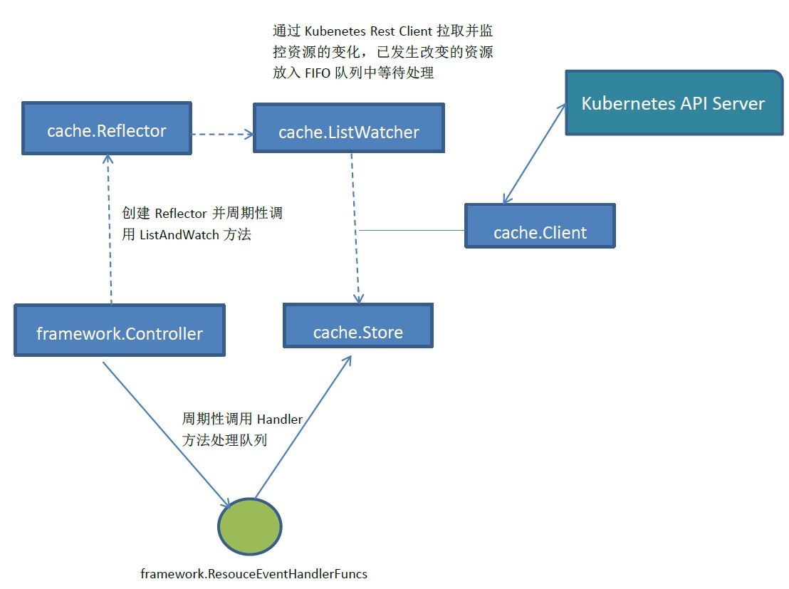
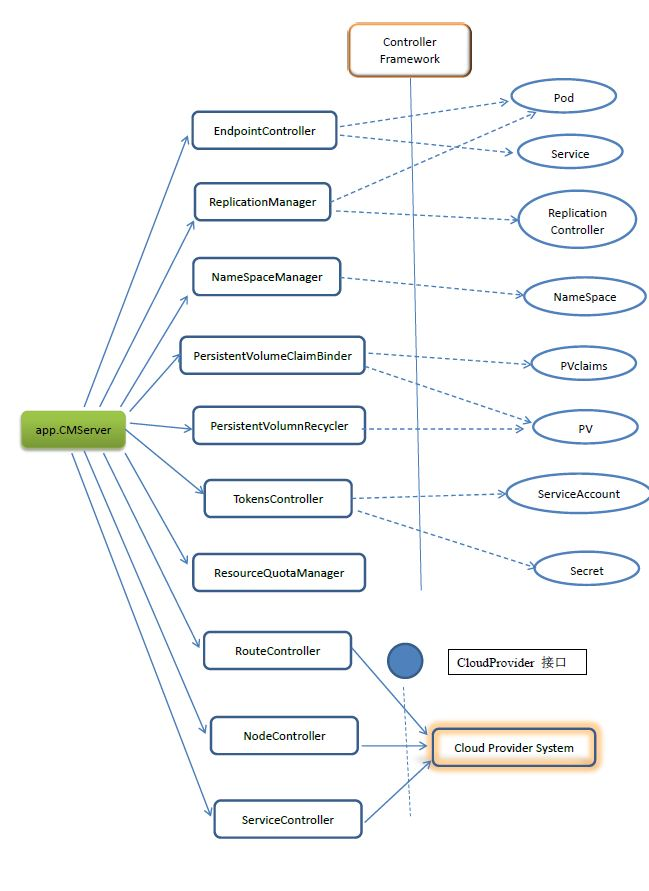

# 13 Kube-controller CMServer Design Summary#

Kubernetes Controller Server的设计没有Kubernetes API Server复杂，但是依旧精彩。Controller Framework设计精巧使得整个进程中各种资源对象的同步逻辑在代码实现方面保持了高度一致性与简洁性。此外，在关键资源RC的同步逻辑中所采用的流控机制也简单、高效。

## 13.1 Controller Framework Summary ##
本节，我们针对Kubernetes Controller Server中的精华部分--Controller Framework的设计做一个整体分析。首先，framework.Controller 内部维护了一个Config对象，保留了一个标准的消息、实践分发系统的三要素：

- 生产者：cache.ListerWatch
- 队列：cache.cacheStore(Queue)
- 消费者：用回调函数来模拟（framework.ResourceEventHandlerFuncs）。

由于生产者的逻辑比较复杂，在这个系统中也有其特殊性，即拉取资源并监控资源的变化，由此产生了真正的待处理任务，所以又设计了一个ListerWatcher接口，将底层的复杂逻辑“框架化”，放入cache.Reflector中，使用者只是简单的实现ListerWatcher接口的ListFunc与WatchFunc即可。另外，cache.Reflector也是独立于Controller Framework的一个组件，隶属于cache包，它的功能是将任意资源拉倒本地缓存中并监控资源的变化，保持本地缓存的同步，其目标是减轻对Kubernetes API Server的请求压力。

图13-1 给出了Controller Framework的整体架构设计图。

图13-1 Controller Framework 整体架构设计图

## 13.2 ControllerManager Server Summary ##

Kubernetes Controller Server中所有设计同步的资源都采用了Controller Framework框架来驱动，图13-2给出了整体设计示意图。

图13-2 Kubernetes CMServer 整体设计示意图 

从图13-2可以看出，除了Node、Route、CloudServer这三个资源依赖于Kubernetes所处的云计算环境，只能通过CloudProvider接口所提供的API来完成资源同步。其它资源都采用了Controller Framework框架来进行资源同步。图中的虚线箭头表示针对目标资源创建了一个framework.Controller对象，其中的某些资源如RC、PV、Tokens的同步过程需要获取并监听其他与之相连的资源对象。

这里只有ResourceQuato资源比较另类，它没有采用Controller Framework,一个原因是ResourceQuota涉及很多资源对象，不大好应用framework.Controller,另外一个原因可能是写ResourceQuotaManager的大牛拥有比较浪漫的情怀，看看下面这段Kubernetets中最优美的代码：

	func(rm *ResourceQuotaManager)Run(period time.Duration)
	{	
		rm.syncTime = time.Tick(period)
		go until.Forever(func(){rm.synchronize},period)
	}

从此它们过上了幸福的生活，一去不复返了！

此处是Kubernetes v1.0的代码，在现有v1.3版本已经有变化。后续有时间再做详细分析。

## 13.3 其它控制器详解。。。。 ##
先过一遍整体代码结构，后续有时间再做详细分析