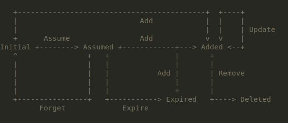

# 15 Kube-Scheduler-Server #

Kubernetets Scheduler Server是由kube-scheduler进程实现的，它运行在Kubernetes的管理节点--Master上并主要负责完成从Pod到Node的调度过程，Kubernetes Scheduler Server跟踪Kubernetes集群中所有Node的资源利用情况，并采取合适的调度策略，确保调度的均衡性，避免集群中的某些节点“过载”。从某种意义上来说，Kubernetes Scheduler Server也是Kubernetes集群的“大脑”。

Kubernetes不真正关心服务究竟运行在哪台机器上，它们最关心服务的可靠性，希望发生故障后能自动回复。遵循这一指导思想，Kubernetes实现了“完全市场经济”的调度原则，并抛弃了传统意义上的“计划就经济”。

## 15.1 Kube-Scheduler 启动流程 ##

Kube-Scheduler 进程的入口类源码在`plugin/cmd/kube-scheduler/scheduler.go`，入口main函数的逻辑如下：

	func main() {
		s := options.NewSchedulerServer() //创建一个Scheduler Server对象
		s.AddFlags(pflag.CommandLine) //将命令行参数传入
	
		flag.InitFlags()
		logs.InitLogs()
		defer logs.FlushLogs()
	
		verflag.PrintAndExitIfRequested()
	
		app.Run(s) //进入Scheduler Server Run()方法，无限循环运行
	}

上述代码的逻辑和api-server,kube-controller-manager的启动代码风格和逻辑一致。其过程如下：  
1）创建一个Scheduler Server对象；  
2）将命令行参数传入 Scheduler Server；  
3）进入Scheduler Server Run()方法，无限循环运行。  

首先查看SchedulerServer的数据结构，v1.3版本的SchedulerServer结构体如下：

	type SchedulerServer struct {
		componentconfig.KubeSchedulerConfiguration //KubeScheduler组件配置
		Master string //Kubernetes API Server地址
		Kubeconfig string
	}

SchedulerServer has all the context and params needed to run a Scheduler.SchedulerServer结构体各参数解释如下：  

- **Master**： is the address of the Kubernetes API server (overrides any value in kubeconfig).
- **Kubeconfig**：Path to kubeconfig file with authorization and master location information.
- **componentconfig.KubeSchedulerConfiguration**

componentconfig.KubeSchedulerConfiguration结构体如下：

	type KubeSchedulerConfiguration struct {
		unversioned.TypeMeta
	
		// port is the port that the scheduler's http service runs on.
		Port int32 `json:"port"`
		// address is the IP address to serve on.
		Address string `json:"address"`
		// algorithmProvider is the scheduling algorithm provider to use.
		AlgorithmProvider string `json:"algorithmProvider"`
		// policyConfigFile is the filepath to the scheduler policy configuration.
		PolicyConfigFile string `json:"policyConfigFile"`
		// enableProfiling enables profiling via web interface.
		...
		// leaderElection defines the configuration of leader election client.
		LeaderElection LeaderElectionConfiguration `json:"leaderElection"`
	}

其中重要的参数有两个：

- AlgorithmProvider：对应参数algorithm-provider，是AlgorithmProviderConfig的名称。
- PolicyConfigFile：用来加载调度策略配置文件。

从代码上看这两个参数的作用其实是一样的，都是加载一组调度规则，这组调度规则要么在程序里定义为一个AlgorithmProviderConfig，要么保存到文件PolicyConfigFile中。

在创建一个Scheduler结构体实例后，调用`func Run(s *options.SchedulerServer)`方法，以启动Scheduler Server，其关键流程如下：

（1）首先，创建一个REST Client 对象，用于访问Kubernetes API Server提供的API服务：

	kubeClient, err := client.New(kubeconfig)
	if err != nil {
		glog.Fatalf("Invalid API configuration: %v", err)
	}

（2）随后，创建一个HTTP Server以提供必要的性能分析（Performance Profile）和性能指标度量（Metrics）的Rest服务:

	go func() {
			mux := http.NewServeMux()
			healthz.InstallHandler(mux)
			if s.EnableProfiling {
				mux.HandleFunc("/debug/pprof/", pprof.Index)
				mux.HandleFunc("/debug/pprof/profile", pprof.Profile)
				mux.HandleFunc("/debug/pprof/symbol", pprof.Symbol)
			}
			configz.InstallHandler(mux)
			mux.Handle("/metrics", prometheus.Handler())
	
			server := &http.Server{
				Addr:    net.JoinHostPort(s.Address, strconv.Itoa(int(s.Port))),
				Handler: mux,
			}
			glog.Fatal(server.ListenAndServe())
		}()

(3)接下来，程序启动ConfigFactory，这个结构体包含了创建一个Scheduler所需的必要属性。ConfigFactory的结构体如下所示：

	// ConfigFactory knows how to fill out a scheduler config with its support functions.
	type ConfigFactory struct {
		Client *client.Client
		// queue for pods that need scheduling
		PodQueue *cache.FIFO
		// a means to list all known scheduled pods.
		ScheduledPodLister *cache.StoreToPodLister
		// a means to list all known scheduled pods and pods assumed to have been scheduled.
		PodLister algorithm.PodLister
		// a means to list all nodes
		NodeLister *cache.StoreToNodeLister
		...
		// a means to list all services
		ServiceLister *cache.StoreToServiceLister
		// a means to list all controllers
		ControllerLister *cache.StoreToReplicationControllerLister
		...
	}

其中关键的ConfigFactory属性如下：

- PodQueue：需要调度的Pod队列。
- **BindingPodsRateLimiter**:调度过程中限制Pod绑定速度的限速器。？？？V1.3版本有改动，在哪里？？
- **modeler**:这是用于优化pod调度过程而设计的一个特殊对象，用于“预测未来”。一个Pod被计划调度到机器A的事实被称为assumed调度，这些调度安排被保存到特定队列里，此时调度过程是能看到这个预安排的，因而会影响到其它Pod的调度。  ？？？  --->v1.3版本改成SchedulerCache
- PodLister:负责拉取已经调度过的，以及被假定调度过的Pod列表。
- NodeLister:负责拉取Node节点列表。
- ServiceLister:负责拉取Kubernetes服务列表。
- SchedulerPodLister、scheduledPodPopulator:Controller框架创建过程中返回的Store对象与Controller对象，负责定期从Kubernetes API Server上拉取已经调度好的Pod列表，并将这些Pod从modeler的假定调度过的队列中删除。---V1.3版本采用framework.NewIndexerInformer（）方法创建。。

在构造ConfigFactory的方法factory.NewConfigFactory(kubeClient，...)中，我们看到下面这段代码：

	c.ScheduledPodLister.Indexer, c.scheduledPodPopulator = framework.NewIndexerInformer(
		c.createAssignedNonTerminatedPodLW(),
		&api.Pod{},
		0,
		framework.ResourceEventHandlerFuncs{
			AddFunc:    c.addPodToCache,
			UpdateFunc: c.updatePodInCache,
			DeleteFunc: c.deletePodFromCache,
		},
		cache.Indexers{cache.NamespaceIndex: cache.MetaNamespaceIndexFunc},
	)

从上述代码中可以看到controller framework的身影，上述controller实例所做的事情是获取并监听已经调度的Pod列表，并将这些Pod列表从SchedulerCache(modeler)中的"assumed"队列中删除。

（4）接下来，启动进程用上述创建好的ConfigFactory对象作为参数来调用SchedulerServer的createConfig方法，创建一个Scheduler.Config对象。

	//  plugin/cmd/kube-scheduler/app/server.go
	func createConfig(s *options.SchedulerServer, configFactory *factory.ConfigFactory) (*scheduler.Config, error) {
		if _, err := os.Stat(s.PolicyConfigFile); err == nil {
			var (
				policy     schedulerapi.Policy
				configData []byte
			)
			configData, err := ioutil.ReadFile(s.PolicyConfigFile)
			if err != nil {
				return nil, fmt.Errorf("unable to read policy config: %v", err)
			}
			if err := runtime.DecodeInto(latestschedulerapi.Codec, configData, &policy); err != nil {
				return nil, fmt.Errorf("invalid configuration: %v", err)
			}
			return configFactory.CreateFromConfig(policy)
		}
	
		// if the config file isn't provided, use the specified (or default) provider
		return configFactory.CreateFromProvider(s.AlgorithmProvider)
	}

由代码逻辑可知，`createConfig（）`方法调用`CreateFromConfig（）`或者`CreateFromProvider（）`创建一个Scheduler.Config对象，而调用方法均通过解析配置调用CreateFromKeys函数实现。分析源码如下：

	// Creates a scheduler from a set of registered fit predicate keys and priority keys.
	func (f *ConfigFactory) CreateFromKeys(predicateKeys, priorityKeys sets.String, extenders []algorithm.SchedulerExtender) (*scheduler.Config, error) {
		...
	
		f.Run() //调用ConfigFactory.Run()方法
	
		algo := scheduler.NewGenericScheduler(f.schedulerCache, predicateFuncs, priorityConfigs, extenders)
	
		...

		return &scheduler.Config{
							... 	
						}
	}

	func (f *ConfigFactory) Run() {
		// Watch and queue pods that need scheduling.
		cache.NewReflector(f.createUnassignedNonTerminatedPodLW(), &api.Pod{}, f.PodQueue, 0).RunUntil(f.StopEverything)
	
		// Begin populating scheduled pods.
		go f.scheduledPodPopulator.Run(f.StopEverything)
	
		// Begin populating nodes.
		go f.nodePopulator.Run(f.StopEverything)
	
		// Watch PVs & PVCs
		// They may be listed frequently for scheduling constraints, so provide a local up-to-date cache.
		cache.NewReflector(f.createPersistentVolumeLW(), &api.PersistentVolume{}, f.PVLister.Store, 0).RunUntil(f.StopEverything)
		cache.NewReflector(f.createPersistentVolumeClaimLW(), &api.PersistentVolumeClaim{}, f.PVCLister.Store, 0).RunUntil(f.StopEverything)
	
		// Watch and cache all service objects. Scheduler needs to find all pods
		// created by the same services or ReplicationControllers/ReplicaSets, so that it can spread them correctly.
		// Cache this locally.
		cache.NewReflector(f.createServiceLW(), &api.Service{}, f.ServiceLister.Store, 0).RunUntil(f.StopEverything)
	
		// Watch and cache all ReplicationController objects. Scheduler needs to find all pods
		// created by the same services or ReplicationControllers/ReplicaSets, so that it can spread them correctly.
		// Cache this locally.
		cache.NewReflector(f.createControllerLW(), &api.ReplicationController{}, f.ControllerLister.Indexer, 0).RunUntil(f.StopEverything)
	
		// Watch and cache all ReplicaSet objects. Scheduler needs to find all pods
		// created by the same services or ReplicationControllers/ReplicaSets, so that it can spread them correctly.
		// Cache this locally.
		cache.NewReflector(f.createReplicaSetLW(), &extensions.ReplicaSet{}, f.ReplicaSetLister.Store, 0).RunUntil(f.StopEverything)
	}

可知其主要过程如下：

1）创建一个与Pod相关的Reflector对象并定期执行，该Reflector负责查询并监测待调度的Pod列表，即还没有分配主机的Pod（Unsigned Pod），然后把它们放入ConfigFactory的PodQueue中等待调度。相关代码为：

	cache.NewReflector(f.createUnassignedNonTerminatedPodLW(), &api.Pod{}, f.PodQueue, 0).RunUntil(f.StopEverything)
2)启动ControllerFactory的scheduledPodPopulator对象，负责定期从Kubernetes APIServer 上拉取已经调度好的Pod列表，并将这些Pod从modeler（SchedulerCache）中的假定（assumed）调度过的队列中删除。相关代码为
	
	go f.scheduledPodPopulator.Run(f.StopEverything)。  
3）创建一个Node相关的Reflector对象，并定期执行。该Reflector负责查询并监测可用的Node列表（可用意味着Node的spec.unscheduable属性为false），这些Node被放入ConfigFactory的NodeLister.Store里。相关的代码为：
	
	go f.nodePopulator.Run(f.StopEverything) 
其中nodePopulator的创建代码如下：
		
	c.NodeLister.Store, c.nodePopulator = framework.NewInformer(
			c.createNodeLW(),
			&api.Node{},
			0,
			framework.ResourceEventHandlerFuncs{
				AddFunc:    c.addNodeToCache,
				UpdateFunc: c.updateNodeInCache,
				DeleteFunc: c.deleteNodeFromCache,
			},
		)

4)Watch PVs & PVCs They may be listed frequently for scheduling constraints, so provide a local up-to-date cache.

5）创建一个Service相关的Reflector对象并定期执行，该Reflector负责查询并监测已定义的Service列表，并放入ConfigFactory的ServiceLister.Store里。这个过程的目的是Scheduler需要知道一个Service当前所创建的所有Pod，以便能正确地进行调度。相关代码为：

	cache.NewReflector(f.createServiceLW(), &api.Service{}, f.ServiceLister.Store, 0).RunUntil(f.StopEverything)
6)...

7)调用f.run()函数之后，创建了一个实现algorithm.ScheduleAlgorithm接口的对象genericScheduler，它负责完成从Pod到Node的具体调度工作，调度完成的Pod放入ConfigFactory的PodLister里。相关代码为：

	algo := scheduler.NewGenericScheduler(f.schedulerCache, predicateFuncs, priorityConfigs, extenders)

8)最后一步，使用之前的这些信息创建Scheduler.Config对象并返回。

	return &scheduler.Config{
			SchedulerCache: f.schedulerCache,
			// The scheduler only needs to consider schedulable nodes.
			NodeLister:          f.NodeLister.NodeCondition(getNodeConditionPredicate()),
			Algorithm:           algo,
			Binder:              &binder{f.Client},
			PodConditionUpdater: &podConditionUpdater{f.Client},
			NextPod: func() *api.Pod {
				return f.getNextPod()
			},
			Error:          f.makeDefaultErrorFunc(&podBackoff, f.PodQueue),
			StopEverything: f.StopEverything,
		}, nil
	}

从上面的分析我们看出，其实在创建Scheduler.Config的过程中已经完成了Kubernetes Scheduler Server进程中的很多启动工作，于是整个进程的启动过程的最后一步就简单明了。

（5）使用刚刚建好的Config对象来构造一个Scheduler对象并启动运行。即下面的代码:

	sched := scheduler.New(config)

	run := func(_ <-chan struct{}) {
		sched.Run()
		select {}
	}

Scheduler的Run方法就是不停地执行scheduleOne方法：

	// Run begins watching and scheduling. It starts a goroutine and returns immediately.
	func (s *Scheduler) Run() {
		go wait.Until(s.scheduleOne, 0, s.config.StopEverything)
	}

ScheduleOne方法的逻辑也比较清晰，即获取下一个待调度的Pod，然后交给genericScheduler进行调度（完成Pod到某个Node的绑定过程），调度过程中通知Modeler。这个过程同时增加了限流和性能指标的逻辑。

	func (s *Scheduler) scheduleOne() {
		pod := s.config.NextPod()
		dest, err := s.config.Algorithm.Schedule(pod, s.config.NodeLister)
		...
		assumed := *pod
		assumed.Spec.NodeName = dest
		...
		go func() {
			defer metrics.E2eSchedulingLatency.Observe(metrics.SinceInMicroseconds(start))
	
			b := &api.Binding{
				ObjectMeta: api.ObjectMeta{Namespace: pod.Namespace, Name: pod.Name},
				Target: api.ObjectReference{
					Kind: "Node",
					Name: dest,
				},
			}

			err := s.config.Binder.Bind(b)
	
			...
	}

## 15.2 Scheduler-Cache 缓存机制##

### 15.2.1 schedulerCache结构体 ###

 Cache collects pods' information and provides node-level aggregated information.It's intended for generic scheduler to do efficient lookup. 首先查看SchedulerCache的结构体：

	type schedulerCache struct {
		stop   <-chan struct{}
		ttl    time.Duration
		period time.Duration
	
		// This mutex guards all fields within this cache struct.
		mu sync.Mutex
		// a set of assumed pod keys.
		// The key could further be used to get an entry in podStates.
		assumedPods map[string]bool
		// a map from pod key to podState.
		podStates map[string]*podState
		nodes     map[string]*NodeInfo
	}

结构体中缓存了nodes的信息，在做判断和排序的时候都会用到。这个nodes是一个map,key是node的name，value 是一个封装的NodeInfo，非常值得一提的是,NodeInfo包含了node上的pod的一个集合：

	// NodeInfo is node level aggregated information.
	type NodeInfo struct {
		// Overall node information.
		node *api.Node
	
		pods             []*api.Pod
		podsWithAffinity []*api.Pod
	
		// Total requested resource of all pods on this node.
		// It includes assumed pods which scheduler sends binding to apiserver but
		// didn't get it as scheduled yet.
		requestedResource *Resource
		nonzeroRequest    *Resource
		// We store allocatedResources (which is Node.Status.Allocatable.*) explicitly
		// as int64, to avoid conversions and accessing map.
		allocatableResource *Resource
		// We store allowedPodNumber (which is Node.Status.Allocatable.Pods().Value())
		// explicitly as int, to avoid conversions and improve performance.
		allowedPodNumber int
	
		// Whenever NodeInfo changes, generation is bumped.
		// This is used to avoid cloning it if the object didn't change.
		generation int64
	}

	// Resource is a collection of compute resource.
	type Resource struct {
		MilliCPU  int64
		Memory    int64
		NvidiaGPU int64
	}

从NodeInfo结构体我们可以看出，里面包含了node上已经被pods使用了的资源，这样在判断及排序的时候才可以做出决策。注意，这里的pods数组是pod的指针的数组，所以pod很多时，数组也不会很大，这里也体现了k8s设计的细微之处，这个结构体里面全部是指针形式出现的，所以在复杂的逻辑中，也不太会影响效率。

### 15.2.2 schedulerCache 接口 ###

Cache's operations are pod centric. It does incremental updates based on pod events. Pod events are sent via network. We don't have guaranteed delivery of all events: We use Reflector to list and watch from remote. Reflector might be slow and do a relist, which would lead to missing events. State Machine of a pod's events in scheduler's cache:

 Note that an assumed pod can expire, because if we haven't received Add event notifying us
 for a while, there might be some problems and we shouldn't keep the pod in cache anymore.

Note that "Initial", "Expired", and "Deleted" pods do not actually exist in cache.
Based on existing use cases, we are making the following assumptions:

 - No pod would be assumed twice
 - A pod could be added without going through scheduler. In this case, we will see Add but not Assume event.
- If a pod wasn't added, it wouldn't be removed or updated.
- Both "Expired" and "Deleted" are valid end states. In case of some problems, e.g. network issue,
a pod might have changed its state (e.g. added and deleted) without delivering notification to the cache.

对应的Cache接口如下：

	type Cache interface {
		// AssumePod assumes a pod scheduled and aggregates the pod's information into its node.
		// The implementation also decides the policy to expire pod before being confirmed (receiving Add event).
		// After expiration, its information would be subtracted.
		AssumePod(pod *api.Pod) error
	
		// ForgetPod removes an assumed pod from cache.
		ForgetPod(pod *api.Pod) error
	
		// AddPod either confirms a pod if it's assumed, or adds it back if it's expired.
		// If added back, the pod's information would be added again.
		AddPod(pod *api.Pod) error
	
		// UpdatePod removes oldPod's information and adds newPod's information.
		UpdatePod(oldPod, newPod *api.Pod) error
	
		// RemovePod removes a pod. The pod's information would be subtracted from assigned node.
		RemovePod(pod *api.Pod) error
	
		// AddNode adds overall information about node.
		AddNode(node *api.Node) error
	
		// UpdateNode updates overall information about node.
		UpdateNode(oldNode, newNode *api.Node) error
	
		// RemoveNode removes overall information about node.
		RemoveNode(node *api.Node) error
	
		// UpdateNodeNameToInfoMap updates the passed infoMap to the current contents of Cache.
		// The node info contains aggregated information of pods scheduled (including assumed to be)
		// on this node.
		UpdateNodeNameToInfoMap(infoMap map[string]*NodeInfo) error
	
		// List lists all cached pods (including assumed ones).
		List(labels.Selector) ([]*api.Pod, error)
	}

SchedulerCache实现了Cache的接口方法，从而实现了对Pod和Node的Add/Update/Remove等操作。这里需要特别说明为什么存在“AssumedPod”？由于Rest Watch API存在延时，当前已经调度好的Pod很可能还没及时 通知给Scheduler，于是就给每个刚刚调度好的Pod发放一个“暂住证”，安排暂住到"AssumedPod"队列里。然后设计一个获取当前“已调度”的Pod队列的新方法，该方法合并Assumed队列与Watch缓存队列，这样一来就有效解决了上述问题。

而SchedulerCache通过assumedPod(),forgetPod等方法维护Pod的的队列（待处理或者已处理）信息。SchedulerCache通过维护NodeInfo结构体的信息实现Pod到Node映射信息的实时更新，通过`NodeInfo`的addPod()/`removePod（）`方法向Node中添加/删除一个Pod。相应的源码如下：

	// addPod adds pod information to this NodeInfo.
	func (n *NodeInfo) addPod(pod *api.Pod) {
		cpu, mem, nvidia_gpu, non0_cpu, non0_mem := calculateResource(pod)
		n.requestedResource.MilliCPU += cpu
		n.requestedResource.Memory += mem
		n.requestedResource.NvidiaGPU += nvidia_gpu
		n.nonzeroRequest.MilliCPU += non0_cpu
		n.nonzeroRequest.Memory += non0_mem
		n.pods = append(n.pods, pod)
		if hasPodAffinityConstraints(pod) {
			n.podsWithAffinity = append(n.podsWithAffinity, pod)
		}
		n.generation++
	}

SchedulerCache只是同步了节点级别的pod聚合信息，同样是为了减少APIServer的压力，该缓存是逻辑上的概念。pod的新增实际是通过bind操作实现在apiServer上的状态更新，详见`Scheduler.Run()方法`。

## 15.3 Scheduler-factory##

	// ConfigFactory knows how to fill out a scheduler config with its support functions.
	type ConfigFactory struct {
		Client *client.Client
		// queue for pods that need scheduling
		PodQueue *cache.FIFO
		// a means to list all known scheduled pods.
		ScheduledPodLister *cache.StoreToPodLister
		// a means to list all known scheduled pods and pods assumed to have been scheduled.
		PodLister algorithm.PodLister
		// a means to list all nodes
		NodeLister *cache.StoreToNodeLister
		// a means to list all PersistentVolumes
		PVLister *cache.StoreToPVFetcher
		// a means to list all PersistentVolumeClaims
		PVCLister *cache.StoreToPVCFetcher
		// a means to list all services
		ServiceLister *cache.StoreToServiceLister
		// a means to list all controllers
		ControllerLister *cache.StoreToReplicationControllerLister
		...
	}

Factory通过Reflector监听资源的变化，并通过如下方法实现负责查询并监测待调度的Pod列表，即还没有分配主机的Pod（Unsigned Pod），然后把它们放入ConfigFactory的PodQueue中等待调度。然后通过如下方法实现已调度Pod和已变化Node的Cache同步：

	c.ScheduledPodLister.Indexer, c.scheduledPodPopulator = framework.NewIndexerInformer(
		c.createAssignedNonTerminatedPodLW(),
		&api.Pod{},
		0,
		framework.ResourceEventHandlerFuncs{
			AddFunc:    c.addPodToCache,
			UpdateFunc: c.updatePodInCache,
			DeleteFunc: c.deletePodFromCache,
		},
		cache.Indexers{cache.NamespaceIndex: cache.MetaNamespaceIndexFunc},
	)

	c.NodeLister.Store, c.nodePopulator = framework.NewInformer(
		c.createNodeLW(),
		&api.Node{},
		0,
		framework.ResourceEventHandlerFuncs{
			AddFunc:    c.addNodeToCache,
			UpdateFunc: c.updateNodeInCache,
			DeleteFunc: c.deleteNodeFromCache,
		},
	)

其中createAssignedNonTerminatedPodLW和createNodeLW的定义和说明如下：

	// Returns a cache.ListWatch that finds all pods that are
	// already scheduled.
	// TODO: return a ListerWatcher interface instead?
	func (factory *ConfigFactory) createAssignedNonTerminatedPodLW() *cache.ListWatch {
		selector := fields.ParseSelectorOrDie("spec.nodeName!=" + "" + ",status.phase!=" + string(api.PodSucceeded) + ",status.phase!=" + string(api.PodFailed))
		return cache.NewListWatchFromClient(factory.Client, "pods", api.NamespaceAll, selector)
	}
	
	// createNodeLW returns a cache.ListWatch that gets all changes to nodes.
	func (factory *ConfigFactory) createNodeLW() *cache.ListWatch {
		// all nodes are considered to ensure that the scheduler cache has access to all nodes for lookups
		// the NodeCondition is used to filter out the nodes that are not ready or unschedulable
		// the filtered list is used as the super set of nodes to consider for scheduling
		return cache.NewListWatchFromClient(factory.Client, "nodes", api.NamespaceAll, fields.ParseSelectorOrDie(""))
	}

