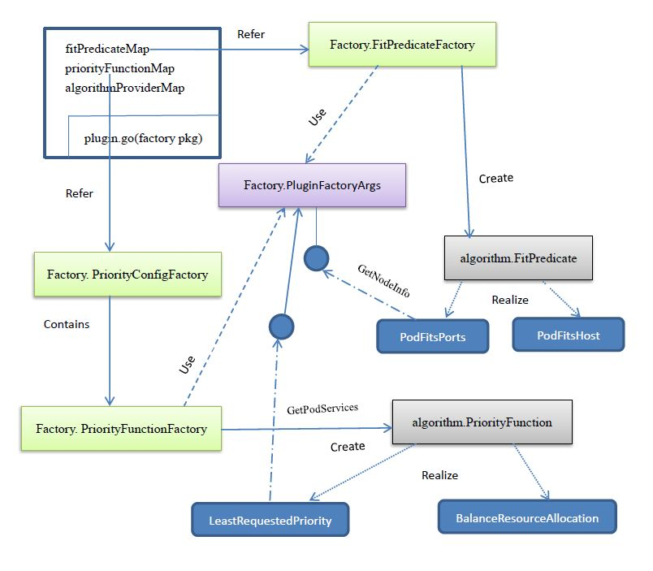

# 17 Kube-Scheduler-DesignSummary #

与之前的Kubernetes API Server和Kubernetes Controller Manager对比，Kubernetes Scheduler Server的设计和代码显得更为“精妙”。Kubernetes Scheduler Server的一个关键设计目标是“插件化”，以方便CloudProvider或者个人用户根据自己的需求进行定制，本节我们围绕最为关键的“FitPredicate”与“PriorityFunction”对其做一个设计总结。

  
图17-1 Kubernetes Scheduler Server调度策略相关设计示意图

如图17-1所示，在plugin.go中采用了全局变量Map变量记录了当前注册的“FitPredicat”和“PriorityFunction”，其中fitPredicateMap和priorityFunctionMap分别存放FitPredicateFactory与PriorityConfigFactory（包含了PriorityFunctionFactory的一个引用）中。可以看出，这里的设计采用了标准的工厂模式。

	// A FitPredicateFactory produces a FitPredicate from the given args.
	type FitPredicateFactory func(PluginFactoryArgs) algorithm.FitPredicate
	
	// A PriorityFunctionFactory produces a PriorityConfig from the given args.
	type PriorityFunctionFactory func(PluginFactoryArgs) algorithm.PriorityFunction
	
	// A PriorityConfigFactory produces a PriorityConfig from the given function and weight
	type PriorityConfigFactory struct {
		Function PriorityFunctionFactory
		Weight   int
	}
	
	var (
		schedulerFactoryMutex sync.Mutex
	
		// maps that hold registered algorithm types
		fitPredicateMap      = make(map[string]FitPredicateFactory)
		priorityFunctionMap  = make(map[string]PriorityConfigFactory)
		algorithmProviderMap = make(map[string]AlgorithmProviderConfig)
	)

factory.PluginFactoryArgs这个数据结构可以认为是一个上下文环境变量，它提供给PluginFactory必要的数据访问接口，比如获取一个Node的详细信息并获取一个Pod上的所有Service信息等，这些接口可以被某些具体的FitPredicate或PriorityFunction使用，以实现特定的功能。图17-1 所示的predicates.PodFitsPorts和priority.LeastRequestedPriority就分别使用了上述接口。

	// PluginFactoryArgs are passed to all plugin factory functions.
	type PluginFactoryArgs struct {
		PodLister                      algorithm.PodLister
		ServiceLister                  algorithm.ServiceLister
		ControllerLister               algorithm.ControllerLister
		ReplicaSetLister               algorithm.ReplicaSetLister
		NodeLister                     algorithm.NodeLister
		NodeInfo                       predicates.NodeInfo
		PVInfo                         predicates.PersistentVolumeInfo
		PVCInfo                        predicates.PersistentVolumeClaimInfo
		HardPodAffinitySymmetricWeight int
		FailureDomains                 []string
	}

我们注意到PluginFactoryArgs的接口都是Kubernetes的资源访问接口，那么为何不直接使用Kubernetes RestClient API访问呢？有以下几个原因：

- 如果使用RestClient API则增加了插件卡法这开发和调试的难度，因为开发者需要再去学习和掌握RESTClient；
- 效率问题。如果大家都采用框架提供的“标准方法”查询资源，那么框架可以实现很多优化，比较容易缓存；？？
- 与“Assumed Pod”有关，即查询当前已经调度过的Pod列表是有其特殊性的，PluginFactoryArgs中的PodLister就是引用了ConfigFactory的PodLister。？？

algorithmProviderMap这个全局变量保存了一组命名的调度策略配置文件AlgorithmProviderConfig，其实就是一组FitPredicate和PriorityFunction的集合。即每个algorithmProviderMap将algorithmProvider的name映射到一组FitPredicate和PriorityFunction的集合。AlgorithmProviderConfig的定义如下

	type AlgorithmProviderConfig struct {
		FitPredicateKeys     sets.String
		PriorityFunctionKeys sets.String
	}

AlgorithmProviderConfig的作用是预配置和自定义调度规则，Kubernetes Scheduler Server默认加载了一个名为“DefaultProvider”的调度策略配置，通过定义和加载不同的调度规则配置文件，我们可以改变默认的调度策略，比如我们可以定义两组规则文件：其中一个命名为“function_test_cfg”，面向功能测试，调度原则尽量在最少的机器上调度Pod以节省资源；另外一个则命名为“performance_test_cfg”，面向性能测试，调度原则尽可能使用更多的机器，以测试系统性能。

至此，Master节点上的进程的源码都已经分析完毕，我们发现这些进程所做的事情，归根到底就是两件事：Pod调度+只能纠错，这也是为什么这些进程所在的节点被称之为“Master”，因为它们高高在上，运筹帷幄。