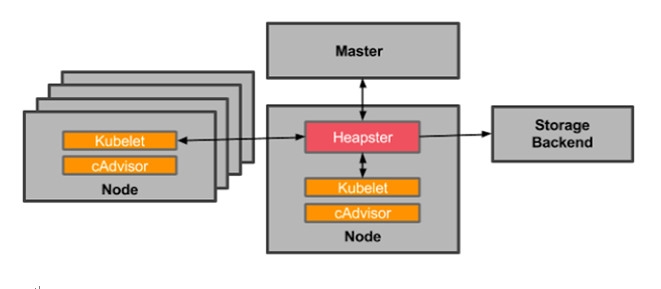

# 18 Kube-Kubelet-Intro #
在Kubernetes集群中，每个Node节点上都会启动一个Kubelet服务进程。该进程用于处理Master节点下发到本节点的任务，管理Pod及Pod中的容器。每个Kubelet进程会在API Server上注册节点自身信息，定期向Master节点汇报节点资源的使用情况，并通过cAdvise监控容器和节点资源。

我们首先查看k8s的官方文档中对kubelet的描述。

The kubelet is the primary “node agent” that runs on each node. The kubelet works in terms of a PodSpec. A PodSpec is a YAML or JSON object that describes a pod. The kubelet takes a set of PodSpecs that are provided through various echanisms (primarily through the apiserver) and ensures that the containers described in those PodSpecs are running and healthy. Other than from an PodSpec from the apiserver, **there are three ways that a container manifest can be provided to the Kubelet**.

- **File**: Path passed as a flag on the command line. This file is rechecked every 20 seconds (configurable with a flag).
- **HTTP endpoint**: HTTP endpoint passed as a parameter on the command line. This endpoint is checked every 20 seconds (also configurable with a flag).
- **HTTP server**: The kubelet can also listen for HTTP and respond to a simple API (underspec’d currently) to submit a new 
- .

从上述描述中我们可以看到，kubelet是在集群中每个node上都必须存在的组件，负责维护管理pod。它的工作主要基于四种source—— apiserver的PodSpec，File，HTTP endpoint及HTTP server——来更新pod。其中，File通过 --file-check-frequency 参数传入， HTTP通过 --http-check-frequency 参数。

## 18.1 节点管理 ##
	
节点通过设置Kubelet的启动参数“--register-node”，来决定是否向API Server注册自己。“--register-node = True”表示Kubelet将试着通过API Server注册自己。作为自注册，Kubelet启动时还包含以下参数：

- --api-servers:告诉Kubelet API Server的位置；
- --kubeconfig:告诉Kubelet在哪儿可以找到用于访问API Server的证书；
- --cloud-provider:告诉Kubelet如何从云服务商（IAAS）那里读到自己相关的元数据。

当前每个Kubelet被授予创建和修改任何节点的权限，但是在实践中，它仅仅创建和修改自己所在节点。将来，计划限制Kubelet的权限，仅允许它修改和创建其所在节点的权限。如果集群在运行过程中遇到集群资源不足的情况，则用户很容易通过添加及其及运用Kubelet的自注册模式来实现扩容。

在某些情况下，Kubernetes集群中的某些Kubelet没有选择自注册模式，用户需要自己去配置Node的资源信息，同时告知Node上的Kubelet API Server的位置。集群管理者能够创建和修改节点信息。如果管理者希望手动创建节点信息，则通过设置Kubelet的启动参数“--register-node=false”即可。

Kubelet在启动时通过API Server注册节点信息，并定时向API Server发送节点新消息，API Server在接收到这些信息后，将这些信息写入etcd。通过Kubelet的启动参数“--node-status-update-frequency”设置Kubelet每隔多少时间向API Server报告节点状态，默认为10秒。

## 18.2 Pod管理 ##

Kubelet通过以下几种方式获取自身Node上所要运行的Pod清单。

- 文件：Kubelet启动参数“--config”指定的配置文件目录下的文件（默认目录为“/etc/kubernetes/manifests”）。通过--file-check-frequency设置检查该文件目录的时间间隔，默认为20秒。
- HTTP端点（URL）：通过“--manifest-url”参数设置。通过--http-check-frequency设置检查该HTTP端点的数据时间间隔，默认为20秒。
- API Server：Kubelet通过API Server监听etcd目录，同步Pod清单。

所有以非API Server方式创建的Pod都叫做Static Pod。Kubelet将Static Pod的状态汇报给API Server，API Sevrer为该Static Pod创建一个Mirror Pod和其相匹配,Mirror Pod的状态将真实反映Static Pod的状态。当Static Pod被删除时，对应的Mirror Pod也会被删除。本部分讨论通过API Server获得Pod清单的方式。Kubelet通过API Server Client使用List/Watch的监听方式监听“/registry/nodes/$当前节点的名称”和“/registry/pods”目录，将获取的信息同步到本地缓存中。

Kubelet监听etcd，所有针对Pod的操作都会被Kubelet监听到：

- 如果发现有新的绑定到本节点的Pod，则按照Pod清单的要求创建该Pod。
- 如果发现本地的Pod被修改，则Kubelet会做出相应的修改，比如删除Pod中的某个容器时，则通过Docker Client删除该容器。
- 如果发现删除本节点的Pod，则删除相应的Pod,并通过Docker Client删除Pod中的容器。

Kubelet读取监听到的信息，如果是创建和修改Pod任务，则做如下处理。  
（1）为该Pod创建一个数据目录。  
（2）从API Server读取该Pod清单。  
（3）位该Pod挂载外部卷（External Volume）。   
（4）下载Pod用到的Secret。
（5）检查已经运行在节点中的Pod，如果该Pod没有氢气或pause容器（“kubernetes/pause”镜像创建的容器）没有启动，则先停止Pod里的所有容器的进程。如果在Pod中有需要删除的容器，则删除这些容器。  
（6） 用“Kubernetes/pause”镜像为每个Pod创建一个容器。该pause容器用于接管Pod中所有其它容器的网络。每创建一个新的Pod，Kubelet都会先创建一个pause容器，然后创建其它容器。“kubernetes/pause”镜像大概为200KB，是一个非常小的容器镜像。  
（7）为Pod中的每个容器做如下处理：  
	
- 为容器计算一个hash值，然后用容器的名字去Docker查询对应容器的hash值。若查找到容器，且两者hash值不同，则停止Docker容器的进程，并停止与之关联的pause容器进程；若两者相同，则不做任何处理。
- 如果容器被中止了，且容器没有指定的restartPolicy（重启策略），则不做任何处理；
- 调用Docker Client下载容器镜像，调用Docker Client运行容器。

## 18.3 容器健康检查 ##

Pod通过两类探针来检查容器的健康状态。

- LivenessProbe探针，用于判断容器是否健康，告诉Kubelet一个容器什么时候处于不健康的状态。如果LivenessProbe探针探测到容器不健康，则Kubelet将删除该容器，并根据容器的重启策略做相应的处理。如果一个容器不包含LivenessProbe探针，那么Kubelet认为该容器LivenessProbe探针返回的值永远是“Success”；
- ReadinessProbe探针：用于判断容器是否启动完成，且准备接受请求。如果ReadinessProbe探针检测到失败，则Pod状态将被修改。Endpoint Controller将从Service的Endpoint中删除包含该容器所在Pod的IP地址的Endpoint条目。

Kubelet定期调用容器中的LivenessProbe探针来诊断容器的健康状况。LivenessProbe包含以下三种实现方式：

- ExexAction:在容器内部执行一个命令，如果该命令的推出状态码为0，则表明容器健康；
- TCPSocketAction:通过容器的IP地址和端口号执行TCP检查，如果端口号能被访问，则表明容器健康；
- HTTPFetAction:通过容器的IP地址和端口号及路径调用HTTP Get方法，如果响应的状态码大于等于200且小于等于400，则认为容器状态健康。

LivenessProbe探针包含在Pod定义的spec.containers.{某个容器}中。下面的例子展示了两种Pod中容器健康检查的方式：HTTP检查和容器命令执行检查。

下面所列的内容实现可通过容器命令执行检查：

	LivenessProbe：
		exec:
			command:
			- cat
			- /tmp/health
		initialDelaySeconds:15
		timeoutSeconds:1
Kubelet在容器中执行“cat /tmp/health”命令，如果该命令返回的值为0，则表明容器处于健康状态，否则表明容器处于不健康状态。

下面所列的内容实现了容器的HTTP检查：

	LivenessProbe：
		httpGet:
			path: /healthz
			port:8080
		initialDelaySeconds:15
		timeoutSeconds:1

Kubelet发送一个HTTP请求到本地主机和端口及指定的路径，来检查容器的健康状况。

	
## 18.4 cAdvisor资源监控 ##

在Kubernetes集群中如何监控资源的使用情况？在Kubernetes集群中，应用程序的执行情况可以在不同的级别上检测到，这些级别包括：容器、Pod、Service和整个集群。作为Kubernetes集群的一部分，Kubernetes希望提供给用户详细的各个级别的资源使用信息，这将使用户能够更深入地了解应用的执行情况，并找到应用可能的瓶颈。

Heapster项目为Kubernetes提供了一个基本的监控平台，它是集群级别的监控和事件数据集成器（Aggregator）。Heapster作为Pod运行在Kubernetes集群中，和运行在Kubernetes集群中的其它应用相似，也可以单独运行以standalone的方式。Heapster Pod通过Kubelet发现所有运行在集群中的节点，并查看来自这些节点的资源使用状况信息。Kubelet通过cAdvisor获取其所在节点及容器的数据，Heapster通过带着关联标签的Pod分组这些信息，这些数据被推到一个可配置的后端，用于存储和可视化展示。当前支持的后端（Storage Backend）包括InfluxDB(with Grafana for Visualization) 和 Google Cloud Monitoring。简言之，Heapster 收集所有Kubernetes Node，然后汇总数据，然后可以导到第三方工具（如Influxdb）。

cAdvisor是一个开源的分析容器资源使用率和性能特性的代理工具，即监控agent。在每个Kubernetes Node上都会运行cAdvisor 。cadvisor 会收集本机以及容器的监控数据（CPU, memory, filesystem, and network usage statistics）。 在较新的Kubernetes版本里，cadvior功能已经被集成到了kubelet组件中。在Node节点上可以直接访问cadvisor 的界面。

在大部分Kubernetes集群中，cAdvisor通过它所在节点机的4194端口暴露一个简单的UI。

Kubelet作为连接Kubernetes Master和各节点机之间的桥梁，管理运行在节点机上的Pod和容器。Kubelet将每个Pod转换成它的成员容器，同时从cAdvisor获取单独的容器使用统计信息，然后通过该REST API暴露这些聚合后的Pod资源使用的统计信息。