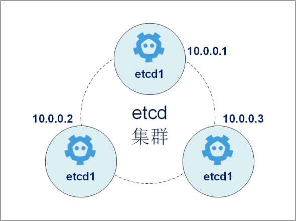
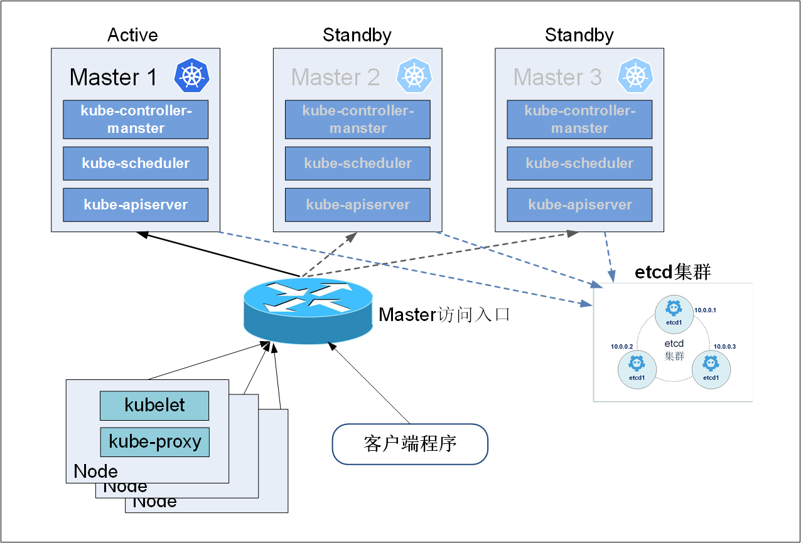
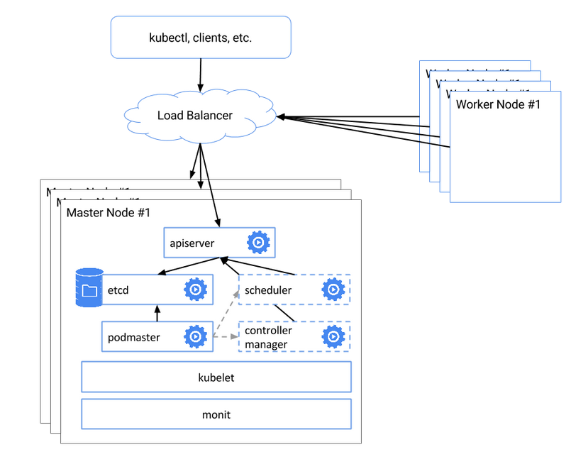

# 4 Kubernetes集群高可用（HA）方案 # 
Kubernetes作为容器应用的管理中心，通过对Pod的数量进行监控，并且根据主机或容器失效的状态将新的Pod调度到其他Node上，实现了应用层的高可用性。针对Kubernetes集群，高可用性还应包含以下两个层面的考虑：etcd数据存储的高可用性和Kubernetes Master组件的高可用性。 

### 4.1．etcd高可用性方案 
etcd在整个Kubernetes集群中处于中心数据库的地位，为保证Kubernetes集群的高可用性，首先需要保证数据库不是单故障点。一方面，etcd需要以集群的方式进行部署，以实现etcd数据存储的冗余、备份与高可用性；另一方面，etcd存储的数据本身也应考虑使用可靠的存储设备。 

etcd集群的部署可以使用静态配置，也可以通过etcd提供的REST API在运行时动态添加、修改或删除集群中的成员。本节将对etcd集群的静态配置进行说明。关于动态修改的操作方法请参考etcd官方文档的说明。 

首先，规划一个至少3台服务器（节点）的etcd集群，在每台服务器上安装好etcd。部署一个由3台服务器组成的etcd集群，其集群部署实例如图4-1所示。   
  
图4-1 etcd集群部署实例

然后，修改每台服务器上的etcd的配置文件/etc/etcd/etcd.conf。以etcd1为**创建**集群的实例，需要将其**ETCD_INITIAL_CLUSTER_STATE设置为"new"**。etcd1的完整配置如下：

	# [member]
	ETCD_NAME=etcd1            #etcd实例名称
	ETCD_DATA_DIR=＂/var/lib/etcd/etcd1＂   #etcd数据保存目录
	ETCD_LISTEN_PEER_URLS=＂http://10.0.0.1:2380＂   #集群内部通信使用的URL
	ETCD_LISTEN_CLIENT_URLS=＂http://10.0.0.1:2379＂   #供外部客户端使用的URL
	……
	#[cluster]
	ETCD_INITIAL_ADVERTISE_PEER_URLS=＂http://10.0.0.1:2380＂   #广播给集群内其他成员使用的URL
	ETCD_INITIAL_CLUSTER=＂etcd1=http://10.0.0.1:2380,etcd2=http://10.0.0.2:2380, etcd3=http://10.0.0.3:2380＂     #初始集群成员列表
	ETCD_INITIAL_CLUSTER_STATE=＂new＂     #初始集群状态，new为新建集群
	ETCD_INITIAL_CLUSTER_TOKEN=＂etcd-cluster＂   #集群名称
	ETCD_ADVERTISE_CLIENT_URLS=＂http://10.0.0.1:2379＂   #广播给外部客户端使用的URL
启动etcd1服务器上的etcd服务：

	$ systemctl restart etcd
启动完成后，就创建了一个名为etcd-cluster的集群。 

etcd2和etcd3为**加入**etcd-cluster集群的实例，**需要将其ETCD_INITIAL_CLUSTER_STATE设置为“exist”**。etcd2的完整配置如下（etcd3的配置略）：

	# [member]
	ETCD_NAME=etcd2            #etcd实例名称
	ETCD_DATA_DIR=＂/var/lib/etcd/etcd2＂   #etcd数据保存目录
	ETCD_LISTEN_PEER_URLS=＂http://10.0.0.2:2380＂   #集群内部通信使用的URL
	ETCD_LISTEN_CLIENT_URLS=＂http://10.0.0.2:2379＂   #供外部客户端使用的URL
	……
	#[cluster]
	ETCD_INITIAL_ADVERTISE_PEER_URLS=＂http://10.0.0.2:2380＂   #广播给集群内其他成员使用的URL
	ETCD_INITIAL_CLUSTER=＂etcd1=http://10.0.0.1:2380,etcd2=http://10.0.0.2:2380,etcd3=http://10.0.0.3:2380＂     #初始集群成员列表
	ETCD_INITIAL_CLUSTER_STATE=＂exist＂       # existing表示加入已存在的集群
	ETCD_INITIAL_CLUSTER_TOKEN=＂etcd-cluster＂   #集群名称
	ETCD_ADVERTISE_CLIENT_URLS=＂http://10.0.0.2:2379＂   #广播给外部客户端使用的URL
启动etcd2和etcd3服务器上的etcd服务：

	$ systemctl restart etcd
启动完成后，在任意etcd节点执行etcdctl cluster-health命令来查询集群的运行状态：

	$ etcdctl cluster-health

在任意etcd节点上执行etcdctl member list命令来查询集群的成员列表：

	$ etcdctl member list

至此，一个etcd集群就创建成功了。 

**以kube-apiserver为例，将访问etcd集群的参数设置为：**

	--etcd-servers=http://10.0.0.1:4001,http://10.0.0.2:4001,http://10.0.0.3:4001
在etcd集群成功启动之后，如果需要对集群成员进行修改，需参考官方文档的详细说明。

对于etcd中需要保存的数据的可靠性，可以考虑使用RAID磁盘阵列、高性能存储设备、NFS网络文件系统，或者使用云服务商提供的网盘系统等来实现。 

### 4.2. Kubernetes Master组件的高可用性方案  ###
在Kubernetes体系中，Master服务扮演着总控中心的角色，主要的三个服务kube-apiserver、kube-controller-mansger和kube-scheduler通过不断与工作节点上的Kubelet和kube-proxy进行通信来维护整个集群的健康工作状态。如果Master的服务无法访问到某个Node，则会将该Node标记为不可用，不再向其调度新建的Pod。但对Master自身则需要进行额外的监控，使Master不成为集群的单故障点，所以对Master服务也需要进行高可用方式的部署。 

以Master的kube-apiserver、kube-controller-mansger和kube-scheduler三个服务作为一个部署单元，类似于etcd集群的典型部署配置。使用至少三台服务器安装Master服务，并且使用Active-Standby-Standby模式，保证任何时候总有一套Master能够正常工作。 

所有工作节点上的Kubelet和kube-proxy服务则需要访问Master集群的统一访问入口地址，例如可以使用pacemaker等工具来实现。图4-2展示了一种典型的部署方式。 
    
图4-2 Kubernetes Master高可用部署架构

We will use the `--leader-elect` flag for each scheduler and controller-manager, using a lease in the API will ensure that only 1 instance of the scheduler and controller-manager are running at once.

Node节点访问时,通过haproxy（pacemaker？？）的入口，分发到不同的apiserver, 而apiserver背后是相同的etcd集群。使用组件podmaster 模拟选举，它利用etcd实现一个选举算法。选举出来的kube-apiserver被启动并作为主出口，其他的kube-apiserver处于standby的状态被停止。当kube-apiserver被选中时，同机的kube-scheduller和kube-controoler-manager起作用，当standby时，同机的3个组件都会不可用。换言之，etcd集群背景下，存在多个kube-apiserver，并用pod-master保证仅是主master可用。同时kube-sheduller和kube-controller-manager也存在多个，但伴随着kube-apiserver,同一时间只能有一套运行。

  
图4-3 Kubernetes HA overview

## 4.3 Kubernetes HA案例分析 ##

待补充。。。