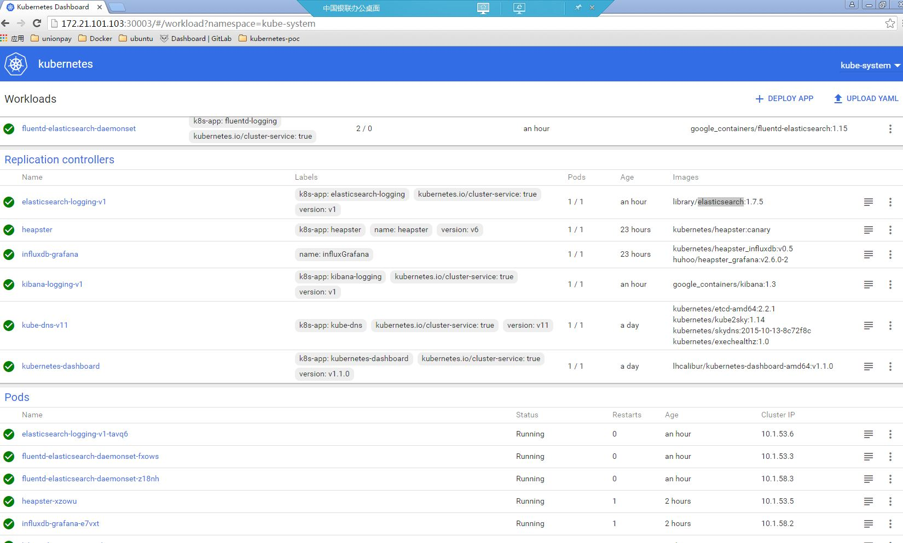

# 7. Kubernetes DashBoard配置#

Dashboard是官方提供的用户管理Kubernets集群可视化工具。

## 7.1 Dashboard功能 ##
Kube dashboard是kube 1.2版本中新增的，具备与kubelet commandline类似的功能，允许用户通过一种新方式与kubernetes集群交互。可以进行增删改查：
    
- 增：新建（分填写的和上传json或yaml的），上传的方式，等同于kubectl create -f
- 删：删除副本（replicationcontrollers）
- 改：修改副本数
- 查：查询相关信息，同kubectl get命令

## 7.2 Dashboard部署 ##

kubernets部署dashboard，只需创建dashboard所需的Replication Controller、Service服务即可。此处部署的是Dashboard V1.1版本。

**1. 编写kube-dashboard ReplicationController和Service配置文件**

kube-dashboard-rc.yaml和kube-dashboard-svc.yaml已上传至GiltLab，[http://172.17.249.122/qsfang/learnk8s/tree/master/poc/yamls/kube-dashboard](http://172.17.249.122/qsfang/learnk8s/tree/master/poc/yamls/kube-dashboard)。

其中`kube-dashboard-rc.yaml`需要修改的说明如下：

	-  --apiserver-host=http://172.21.101.102:8080 //指定API Server

`kube-dashboard-svc.yaml`中指定NodePort方式访问Service，设置如下：

	spec:
	  type: NodePort  //  指定NodePort方式访问Service
	  selector:
	    k8s-app: kubernetes-dashboard
	  ports:
	  - port: 80
	    targetPort: 9090
	    nodePort: 30003  //集群内的所有主机的30003端口均可访问Dashboard Service

**2. 创建kube-dashboard Pod和Service**

通过kubectl create完成RC和Service的创建：

	#  kubectl create -f kube-dashboard-rc.yaml
	#  kubectl create -f kube-dashboard-svc.yaml

查看kube-dashboard相关的RC、Pod、Service是否创建：

	#  kubectl get rc --namespace=kube-system
	#  kubectl get pods --namespace=kube-system
	#  kubectl get services --namespace=kube-system

**3. 通过浏览器访问Dashboard**

Kubernetes dashboard访问地址：http://172.21.101.103:30003,界面如下图所示：

