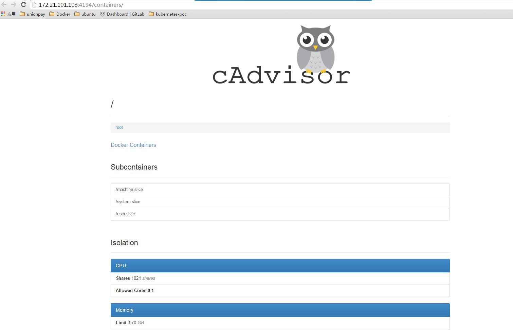
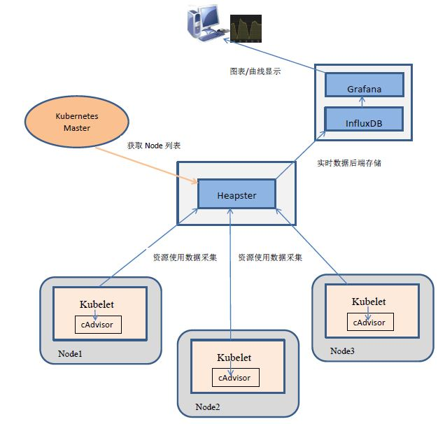
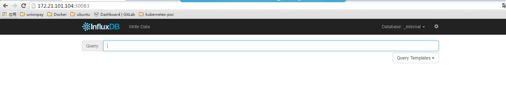
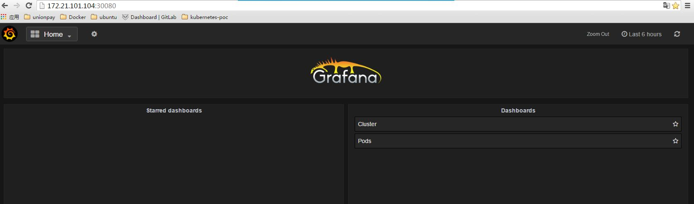

# 8. Kubernetes性能监控 #

## 8.1 cAdvisor 查看容器运行状态##

在Kubernetes系统中，cAdvisor已cadvior功能已经被集成到了kubelet组件中。当Kubelet服务启动时，它会自动启动cAdvisor服务，然后cAdvisor会实时采集所在节点的性能指标及所在节点上运行的容器的性能指标。

kubelet的启动参数--cadvisor-port定义了cAdvisor对外提供服务的端口号，默认为4194。用户就可通过Web界面或REST服务访问当前节点和容器的性能数据。

- **Web界面访问cAdvisor**

cAdvisor Web访问页面为：
[http://172.21.101.103:4194/](http://172.21.101.103:4194) 如下图所示，cAdvisor的主页显示了主机实时运行状态，包括CPU使用情况、内存使用情况、网络吞吐量及文件系统使用情况等。

- **REST服务访问cAdvisor**

cAdvisor提供REST API供客户端远程调用，主要是为了定制开发。API的返回格式为JSON，可以采用如下URL来访问：

	http://<hostname>:<port>/api/<version>/<request>

例如：在Master节点上通过以下URL可访问node1节点的cAdvisor API:

	curl http://node1:4194/api
	curl http://node1:4194/api/v1.3/machine  //获取node1主机的相关信息

容器的性能数据对于集群监控非常有用，系统管理员可以根据cAdvisor提供的数据进行分析和告警。cAdvisor有以下特点：

- cAdvisor在每台Node上运行，只能采集本机的性能指标数据。
- cAdvisor 提供不同的持久化存储后端支持，可以将监控数据保存、汇总到Google BigQuery、InfluxDB或者Redis之上。
- 默认cAdvisor是将数据缓存在内存中，数据展示能力有限。
- 使用cAdvisor需要对每台Node主机单独监控，对大型集群并不使用。

针对大型集群，Kubernetes建议使用开源软件Heapster、InfluxDB和Grafana组成的集成解决方案实现对整个集群的监控。

## 8.2 Kuberneres 集群性能监控##

### 8.2.1 Kubernetes集群监控系统架构 ###

Kubernetes提供一套工具实现集群性能数据的采集、存储和展示：Heapster、InfluxDB和Grafana。

- Heapster：对集群中各Node、Pod的资源使用数据进行采集。项目主页：[https://github.com/kubernetes/heapster](https://github.com/kubernetes/heapster)
	- Heapster访问kubernetes集群中每个Node上的Kubelet API，Kubelet再调用cAdvisor的API采集该节点上的所有容器的性能数据
	- Heapster进行数据聚合，并将结果保存到后端存储系统中。Heapster支持多种后端存储系统，如memory（内存）、**InfluDB**、BigQuery等。
- InfluxDB：分布式时序数据库（每条记录都带有时间戳属性），主要用于实时数据采集、事件跟踪记录、存储时间图标、原始数据等。InfluxDB提供REST API用于数据的存储和查询。web主页：[http://InfluxDB.com](http://InfluxDB.com)
- Grafana：通过Dashboard将InfluxDB中的时序数据展现成图表或曲线等形式，便于运维人员查看集群的运行状态。web主页：[http://Grafana.org](http://Grafana.org)

总体架构下图所示：

### 8.2.2 部署Heapster、InfluxDB、Grafana ###

**1. APIServer Https认证配置**

Heapster当前版本需要使用HTTPS的安全方式访问Kubernetes Master，首先要配置API Server的认证配置。详细参考“Kubernetes TLS(https) 双向认证配置”,链接：

**2. 编写配置文件**

所有配置文件均已上传至GitLab，链接为：[http://172.17.249.122/qsfang/learnk8s/tree/master/poc/yamls/kube-monitoring](http://172.17.249.122/qsfang/learnk8s/tree/master/poc/yamls/kube-monitoring)

- Heapster启动参数设置：
 		
		--source=kubernetes:http://172.21.101.102:8080  //配置监控来源
        --sink=influxdb:http://monitoring-influxdb:8086  //配置后端存储系统，DNS
- Grafana变量配置：

		env:
		  - name: INFLUXDB_SERVICE_URL              //InfluxDB服务的URL
        	value: http://monitoring-influxdb:8086  //数据源，DNS
- 采用NodePort方式访问Service

**3. 创建Service和RC**

使用kubectl create命令完成所有Service和RC的创建：

	kubectl create -f heapster-service.yaml
	kubectl create -f influxdb-service.yaml
	kubectl create -f grafana-service.yaml
	kubectl create -f heapster-controller.yaml
	kubectl create -f influxdb-grafana-controller.yaml

**4.Web访问InfluxDB数据库和Grafana**

- InfluxDB：[http://172.21.101.104:30083/](http://172.21.101.104:30083/) 
	- Heapster在InfluxDB中创建一个名为k8s的数据库
	- Web页面如下图：

- Grafana: [http://172.21.101.104:30080/](http://172.21.101.104:30080/)
	-  Grafana以折现形式展示了所有Node和全部容器的CPU使用率、内存使用情况等。
	-  Web页面如下图：

