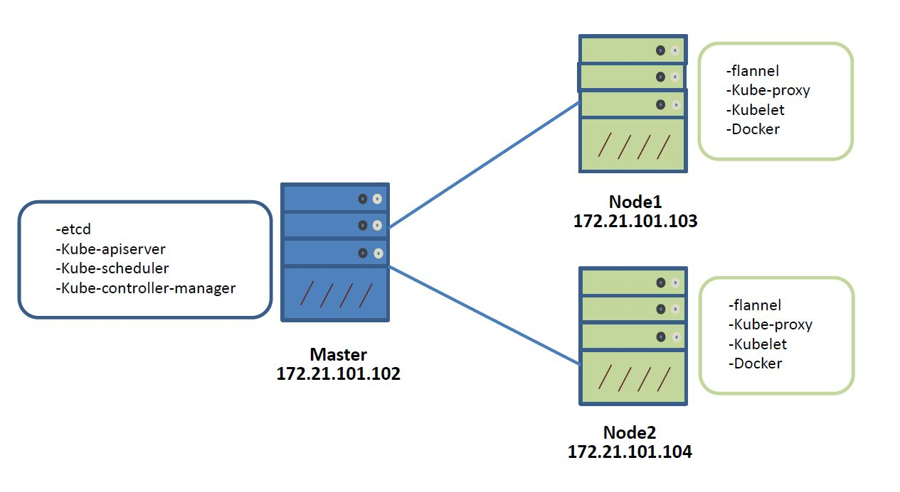

# 1 CentOS 7 Kubernetes 安装指南 #

## 1.1 环境介绍##

**测试环境:**

- 虚拟机:3台，IP:172.21.101.102-104
- 操作系统:CentOS  7.2，64位。

其中一台虚拟机用于搭建Kubernetes Master+etcd,另外两台虚拟机用作Kubernetes Node(Minion)节点。

详细的环境搭建示意图如下图所示：

## 1.2 Kubernetes安装配置 ##

### 准备工作 ###
1. Configure yum Repo:
	
	参考[开发中心内部源设置 for centos](http://172.17.249.122/xhlin/mirrors/tree/master)

2. Disable iptables on each node to avoid conflicts with Docker iptables rules:

		1. $ systemctl stop firewalld
		2. $ systemctl disable firewalld
3. Install NTP and make sure it is enabled and running:
	
	
		1. $ yum -y install ntp
		2. $ systemctl start ntpd
		3. $ systemctl enable ntpd

### 安装配置Kubernetes Master节点 ###

以下步骤用于安装和配置Kubernetes Master节点。由于只有3个节点用于k8s测试，故将etcd安装在master节点。若资源充足，可以单独选取一个host用于提供etcd服务，也可以在多个不同host上安装etcd，形成一个高可用的etcd集群（HA）。

1. 通过yum安装etcd和kubernetes:

		$ yum -y install etcd kubernetes
2. 配置etcd监听所有的IP地址，配置文件为`/etc/etcd/etcd.conf`。其它的相关配置如下:

		1. ETCD_NAME=default
		2. ETCD_DATA_DIR="/var/lib/etcd/default.etcd"
		3. ETCD_LISTEN_CLIENT_URLS="http://0.0.0.0:2379"
		4. ETCD_ADVERTISE_CLIENT_URLS="http://localhost:2379"

3. 配置Kubernetes API Server,配置文件为`/etc/kubernetes/apiserver`. 相关的配置如下:

		1. KUBE_API_ADDRESS="--address=0.0.0.0"
		2. KUBE_API_PORT="--port=8080"
		3. KUBELET_PORT="--kubelet_port=10250"
		// ectd安装在本机上，否则应设为对应etcd服务host的IP地址，监听端口号2379
		4. KUBE_ETCD_SERVERS="--etcd_servers=http://127.0.0.1:2379"
		5. KUBE_SERVICE_ADDRESSES="--service-cluster-ip-range=10.254.0.0/16"
		//未配置ServiceAccount。详细见kubernetes双向认证配置
		6. KUBE_ADMISSION_CONTROL="--admission_control=NamespaceLifecycle,NamespaceExists,LimitRanger,SecurityContextDeny,ResourceQuota"
		7. KUBE_API_ARGS=""
4. 启动并enable Master节点上的etcd, kube-apiserver, kube-controller-manager 和 kube-scheduler，相应脚本如下:
		
		for SERVICES in etcd kube-apiserver kube-controller-manager kube-scheduler; do
		    systemctl restart $SERVICES
		    systemctl enable $SERVICES
		    systemctl status $SERVICES 
		done
5. 定义etcd中的flannel网络配置,对应的配置会被Kubernetes Node节点上的flannel服务使用，并建立对应网段的flannel0网桥（**注意配置子网掩码16位，网段不要和公司内网的网段冲突**）： 

		$ etcdctl mk /atomic.io/network/config '{"Network":"10.1.0.0/16"}'
6. 此时，Kubernetes Master节点上的相关服务已经启动，但是集群中还没有启动Node节点：

		$ kubectl get nodes
		NAME             LABELS              STATUS

### 安装配置Kubernetes Node节点 ###

以下步骤用于安装和配置Kubernetes Node节点。其中Node节点上安装开源的网络组件flannel，即基于flannel搭建Kubernetes依赖的底层网络。

1. 使用yum安装flannel和Kubernetes:

		$ yum -y install flannel kubernetes
2. 配置flannel服务依赖的etcd服务器的IP和端口号，修改配置文件`/etc/sysconfig/flanneld`使得flannel可以连接对应的etcd服务： 

		FLANNEL_ETCD="http://172.21.101.102:2379"
3. 修改Kubernetes的默认配置文件`/etc/kubernetes/config`, 更新`KUBE_MASTER`的值用于连接Kubernetes Master的API Server: 

		KUBE_MASTER="--master=http://192.168.50.130:8080"
4. 配置kubelet服务，配置文件为`/etc/kubernetes/kubelet`。相应的配置如下:

	*Node1:*
	
		KUBELET_ADDRESS="--address=0.0.0.0"
		KUBELET_PORT="--port=10250"
		# 本机IP
		KUBELET_HOSTNAME="--hostname_override=172.21.101.103"
		KUBELET_API_SERVER="--api_servers=http://172.21.101.102:8080"
		# pod infrastructure container,更改为私有仓库的镜像 pause:接管pod的网络
		KUBELET_POD_INFRA_CONTAINER="--pod-infra-container-image=172.17.140.143:80/kubernetes/pause:latest"

		KUBELET_ARGS=""
	
	*Node2:*
	
		KUBELET_ADDRESS="--address=0.0.0.0"
		KUBELET_PORT="--port=10250"
		# 本机IP
		KUBELET_HOSTNAME="--hostname_override=172.21.101.104"
		KUBELET_API_SERVER="--api_servers=http://172.21.101.102:8080"
		# pod infrastructure container,更改为私有仓库的镜像 pause:接管pod的网络
		KUBELET_POD_INFRA_CONTAINER="--pod-infra-container-image=172.17.140.143:80/kubernetes/pause:latest"
		KUBELET_ARGS=""

5. 启动并enable Kubernetes Node节点上的kube-proxy, kubelet, docker and flanneld服务:

		$ for SERVICES in kube-proxy kubelet docker flanneld; do
		    systemctl restart $SERVICES
		    systemctl enable $SERVICES
		    systemctl status $SERVICES 
		done
6. 每个Node节点会增加docker0和flannel0两个网络接口，每个Node节点上会有不同的IP地址段。如下：

	*Node1:*
	
		$ ip a | grep flannel | grep inet
		inet 10.1.53.0/16 scope global flannel0
	*Node2:*
	
		$ ip a | grep flannel | grep inet
		 inet 10.1.58.0/16 scope global flannel0

6. 登录Kubernetes master节点，查看集群的Node节点状态：

		$ kubectl get nodes
		NAME             STATUS    AGE
		172.21.101.103   Ready     22h
		172.21.101.104   Ready     22h

至此，3个节点的Kubernetes集群搭建完毕，后续可在该集群上进行相应的测试。

 

