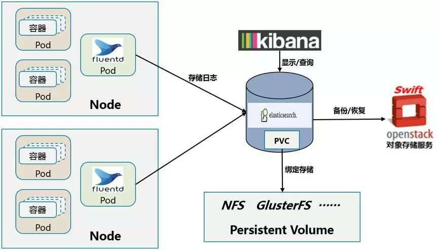
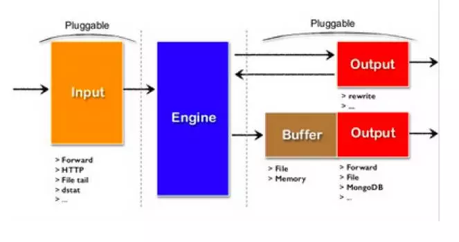
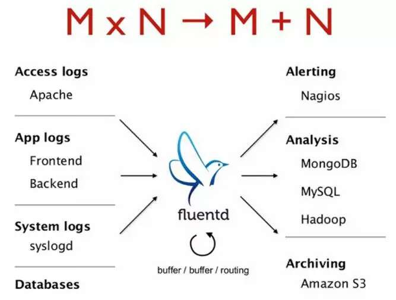
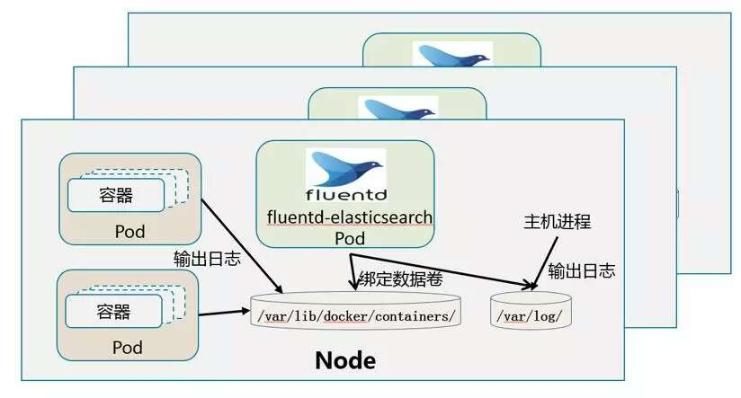
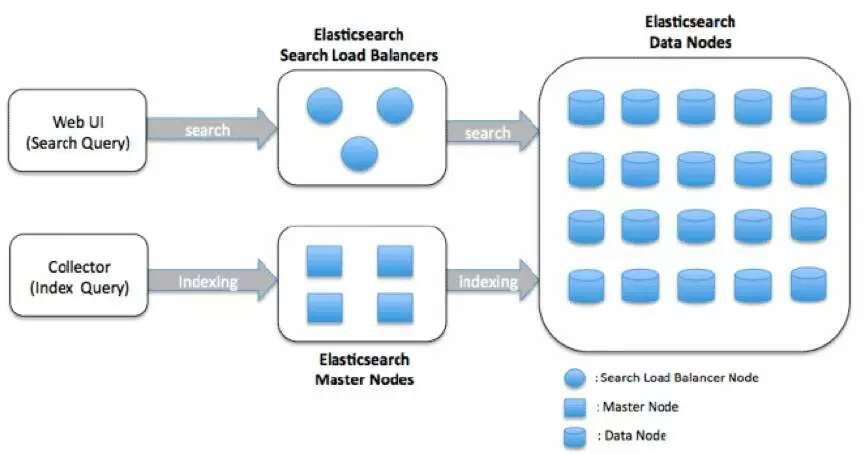
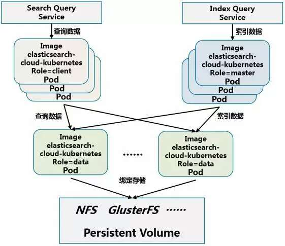

# 10 Kubernetes 集群日志管理 #

Kubernetes集群中日志管理所涉及的技术包括：
 
- Fluentd： 实时日志收集系统
- Elasticsearch： 实时的分布式搜索和分析引擎
- Kibana： 实时日志显示查询--Web前端
- Swift: 日志的本分和恢复（对象存储服务）

整体日志管理系统的架构如下图所示：

在Kubernetes集群中的每个节点上运行一个Fluentd的容器，收集容器的日志发送给到ElasticSearch集群中。ElasticSearch集群会保存一周的日志作为热数据以供实时分析和查询，用户可以通过Kibana查看任意Node、Namespace、Service、Pod和容器的数据。对于超过一周的日志数据，ElasticSearch会自动备份到Swift对象存储的相应Bucket中。

## 10.1 Fluentd、Elasticsearch和Kibana简介 ##

### 10.1.1 Fluentd ###

**1. Fluentd简介**

Fluentd是一个实时日志收集系统，它把JSON作为日志的中间处理格式，通过灵活的插件机制，可以支持丰富多样的日志输入应用、输出应用、以及多种日志解析、缓存、过滤和格式化输出机制。

Fluentd将JSON作为数据处理的中间格式，通过插件式的架构可扩展地支持不同种应用或系统作为日志源和日志输出端。Fluentd的架构如下图所示：

假设有M种输入源Wordpress、MySQL、Tomcat…；N种输出端MySQL、MongoDB、ElasticSearch…那么处理日志的代码模块由MxN减少为M+N。Fluentd功能如下图所示：

**2. Fluentd在Kubernetes集群中的部署架构**

每个Node节点上都要有Fluentd-Elasticsearch这个Pod，有两种方式支持：

 1. 放在/etc/kubernetes/manifest下，用脚本自动启动；
 2. 用DaemonSet启动。

这两种模式都是为了保证在每一个Kubernetes集群节点上都有一个运行的Fluentd驻留Pod来收集日志。Kubernetes中DaemonSet这个API对象就是为了驻留Pod而设计的。

**3. 选用Fluentd的理由：**

- 开销低：核心代码为C，插件代码为Ruby，不需要打包JDK
- 入侵小：用Pod部署，不干扰应用容器和主机服务
- 易部署：使用容器镜像作为单容器Pod部署
- 易定制：很方便增加和更改适合自己应用的插件

### 10.1.2 Elasticsearch ###
Elasticsearch是一个实时的分布式搜索和分析引擎。它可以用于文档存储，全文搜索，结构化搜索以及实时分析，与常见的互联网应用最典型的应用场景是日志分析查询和全文搜索。

**1. ElasticSearch的架构**

在ElasticSearch中有三类节点：

- Data Node：用来存储数据，ElasticSearch中对于一份数据可以有多个副本，以提供数据高可用能力；
- Client Node：查询节点，提供对查询的负载均衡；
- Master Eligible node：索引节点，可以被选举为Master Node，而Master Node会控制整个ElasticSearch集群的状态。

**2. ElasticSearch在Kubernetes中的部署架构**

Kubernetes中，三类节点都是一个包含同一个镜像Pod elasticsearch-cloud-kubernetes，区别只是启动时的环境role不一样。

- 查询和索引节点需要提供对外的Web服务，需要发布为一个Kubernetes Service。
- 数据节点需要绑定一个持久化存储，我们用Kubernetes PV创建出存储卷，数据节点上面通过Kubernetes PVC绑定到相应的数据卷。PV的实际存储可以是NFS、GlusterFS等共享存储。

### 10.1.3 Kibana ###

详细参考： [http://www.cnblogs.com/guozhe/p/5206216.html](http://www.cnblogs.com/guozhe/p/5206216.html)

**1. discover 功能**

Discover 标签页用于交互式探索你的数据。

- 可以访问到匹配得上你选择的索引模式的每个索引的每条记录。
- 可以提交搜索请求，过滤搜索结果，然后查看文档数据。
- 可以看到匹配搜索请求的文档总数，获取字段值的统计情况。
- 如果索引模式配置了时间字段，文档的时序分布情况会在页面顶部以柱状图的形式展示出来。

**2. 设置时间过滤器**

时间过滤器(Time Filter)限制搜索结果在一个特定的时间周期内。如果你的索引包含的是时序诗句，而且你为所选的索引模式配置了时间字段，那么就就可以设置时间过滤器。

**3. 搜索数据**

在 Discover 页提交一个搜索，就可以搜索匹配当前索引模式的索引数据。搜索方式有以下两种。

- 可以直接输入简单的请求字符串，也就是用 Lucene query syntax
- 可以用完整的基于 JSON 的 Elasticsearch Query DSL。

## 10.2 Fluentd、Elasticsearch和Kibana配置过程 ##

**1. 修改docker的日志驱动类型：**

- json-file：该类型就是上面提到的，将标准输出重定向到/var/lib/docker/containers/$CID/$CID-json.log的方式。
- syslog：将日志输出到syslog
- none：禁用日志搜集功能。注意：此时，docker logs命令也被禁用了。

	
	vi /etc/sysconfig/docker	
	OPTIONS='--selinux-enabled --log-driver=json-file' ##或者去掉--log-driver选项，默认为json-file驱动

**2. 编写配置文件**
    
 所有配置文件均已上传至GitLab，链接为：[http://172.17.249.122/qsfang/learnk8s/tree/master/poc/yamls/kube-logging](http://172.17.249.122/qsfang/learnk8s/tree/master/poc/yamls/kube-logging)。

**3. 创建Fluentd DeamonSet,Elasticsearch、Kibana的Service和RC**

	kubectl create -f fluentd-es-daemonset.yaml
	kubectl create -f es-controller.yaml
	kubectl create -f es-service.yaml
	kubectl create -f kibana-controller.yaml
	kubectl create -f kibana-service.yaml

**4.Web访问Kibana**

- Web访问Kibana:[http://172.21.101.104:30081/](http://172.21.101.104:30081/)

- Kibana页面如下图所示：

