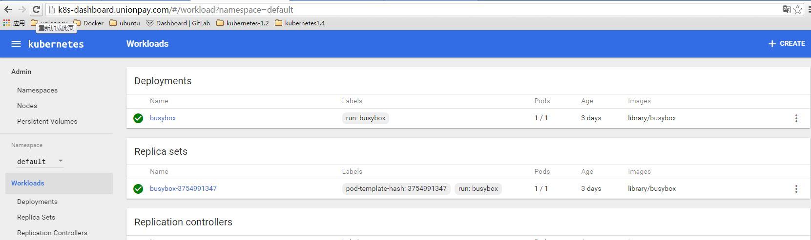
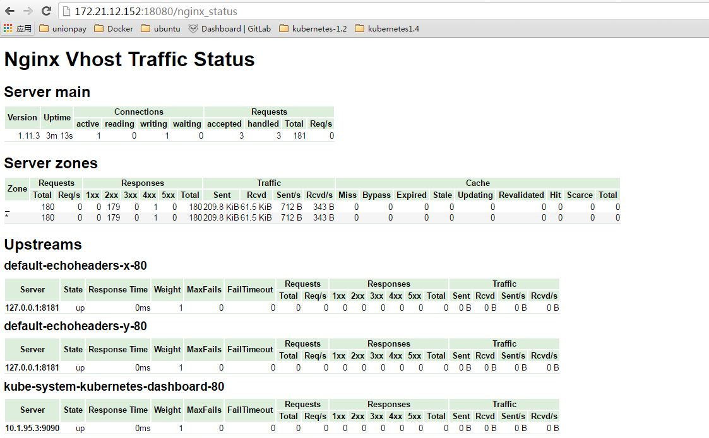

# 11 Kubernetes Nginx Ingress Controller#

Ingress Controller是一个后台进程，以Kubernetes Pod方式部署，监控Apiserver的 `/ingress` endpoint 以及时更新Ingress资源的信息。它的任务是满足ingress的请求。

## 11.1 Nginx Ingress Controller配置过程 ##

**1、编写Nginx Ingress Controller配置文件**

所需yaml配置文件已上传至GitLab, [http://172.17.249.122/qsfang/learnk8s/tree/master/poc/yamls1.4/kube-ingress/examples](http://172.17.249.122/qsfang/learnk8s/tree/master/poc/yamls1.4/kube-ingress/examples)

编写yaml文件时注意：为了显示 nginx_status，需要在80, 443 之外再暴露 nginx ingress 的18080端口：

	ports:
	- containerPort: 80  #http
	  hostPort: 80
	- containerPort: 18080  #nginx_status
	  hostPort: 18080
	- containerPort: 443 #https
	  hostPort: 443
 

同时部署一个configmap文件，启用nginx的vts模块：

	apiVersion: v1
	kind: ConfigMap
	metadata:
	  name: nginx-load-balancer-conf
	data:
	  enable-vts-status: "true"
~

**2、部署Nginx Ingress Controller**

- 首选，部署default backend:

		kubectl create -f default-backend.yaml
		kubectl expose rc default-http-backend --port=80 --target-port=8080 --name=default-http-backend
- LoadBalancers部署通过RC或者DeamonSet实现：
		
		kubectl create -f rc-default.yaml
		kubectl create -f as-daemonset.yaml 

## 11.2 Ingress 访问实例 ##

**1、部署Kubernetes Dashboard**

参考[http://172.17.249.122/qsfang/learnk8s/blob/master/poc/07-kubernetes-Dashboard.md](http://172.17.249.122/qsfang/learnk8s/blob/master/poc/07-kubernetes-Dashboard.md)

**2、创建 dashboard Ingress 实例**

	#dashboard-ingress.yaml													   
	apiVersion: extensions/v1beta1
	kind: Ingress
	metadata:
	  name: k8s-dashboard
	  namespace: kube-system
	spec:
	  tls:
	  - hosts:
	    - k8s-dashboard.unionpay.com   #域名
	    secretName: k8s-dashboard-secret  
	  rules:
	  - host: k8s-dashboard.unionpay.com
	    http:
	      paths:
	      - backend:
	          serviceName: kubernetes-dashboard  #服务名
	          servicePort: 80  #服务端口号
	        path: /
注：请设置 tls， 虚拟主机名，backend service等参数

**3、设置 DNS 或 hosts文件**

在 DNS 或 hosts文件中创建 k8s-dashboard.unionpay.com 记录，之后就可以通过 http://k8s-dashboard.unionpay.com或者 https://k8s-dashboard.unionpay.com 来访问 dashboard 了。

**4、查看Nginx Status**
