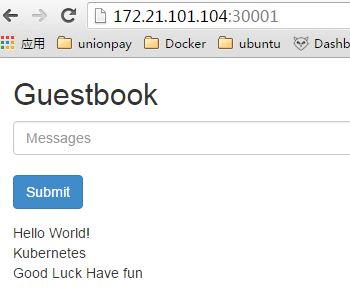
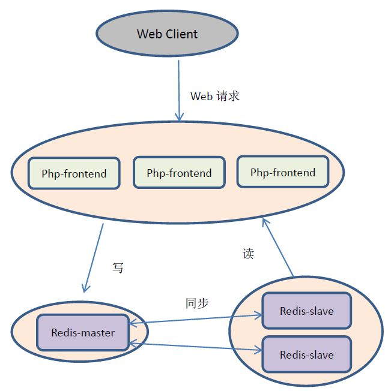

# 2. kubernetes实战-基于redis和docker的留言簿案例 #

## 2.1 Guestbook Design ##

留言板是一个基于PHP+Redis的两层分布式架构的Web应用，前端PHP数据库通过访问后端Redis数据库实现的两层分布式架构的Web应用。前端PHP Web网页通过访问后端Redis数据库来完成用户留言的查询和添加等功能。留言板的网页界面如图2-1所示：

  
图2-1 留言板网页界面

留言板的系统架构如图2-2所示，其设计实现了读写分离，在Redis层采用了一个Master用于前端写操作（添加留言），和两个Slave实例用于前端读操作（读留言）。PHP的Web层同样启动三个实例组成的集群，实现浏览器对网站访问的负载均衡。

图2-2 留言板的系统部署架构

## 2.2 Guestbook Example ##

### 1. 创建redis-master Pod(RC) ###

启动redis-master replication controller，并创建redis-master Pod：

	# kubectl create -f redis-master-controller.json 
	
	
验证radis-master controller运行成功： 
	
	# kubectl get rc
	# kubectl get pods
	 

### 2. 创建redis-master service ###

启动redis-master service：

	# kubectl create -f redis-master-service.json 

验证radis-master service运行成功： 	

	# kubectl get services

### 3. 创建redis-slave Pod(RC) ###

启动redis-slave replication controller，并创建redis-slave Pod：

	# kubectl create -f redis-slave-controller.json 

验证redis-slave replication controller运行成功：

	# kubectl get rc
	# kubectl get pods

### 4. 创建redis-slave Service ###

启动redis-slave Service：
	
	# kubectl create -f redis-slave-service.json

验证radis-slave service运行成功： 

	# kubectl get services

### 5. 创建frontend pod（RC） ###

启动frontend replication controller，并创建frontend Pod：

	# kubectl create -f frontend-controller.json 

验证frontend replication controller运行成功：

	# kubectl get rc
	# kubectl get pods

### 6. 创建frontend Service ###
启动frontend Service：
	
	#kubectl create -f frontend-service.json

验证frontend service运行成功： 
	
	# kubectl get services

### 7. 通过浏览器访问网页 ###

通过NodeIP+NodePort或者LoadBalancers访问集群中的服务，通过spec.type定义。该实验采用NodeIP+NodePort方式，可在浏览器中输入以下URL：
		
	http://NodeIP:NodePort
	//example
	http://localhost:30001

- 若成功，则可看到网页上的一条留言--“Hello World”；
- 若失败，则可能有如下原因：
	- 防火墙问题，无法访问NodePort（30001）端口；
	- 代理上网,错把机器IP当成远程地址；
	- ...