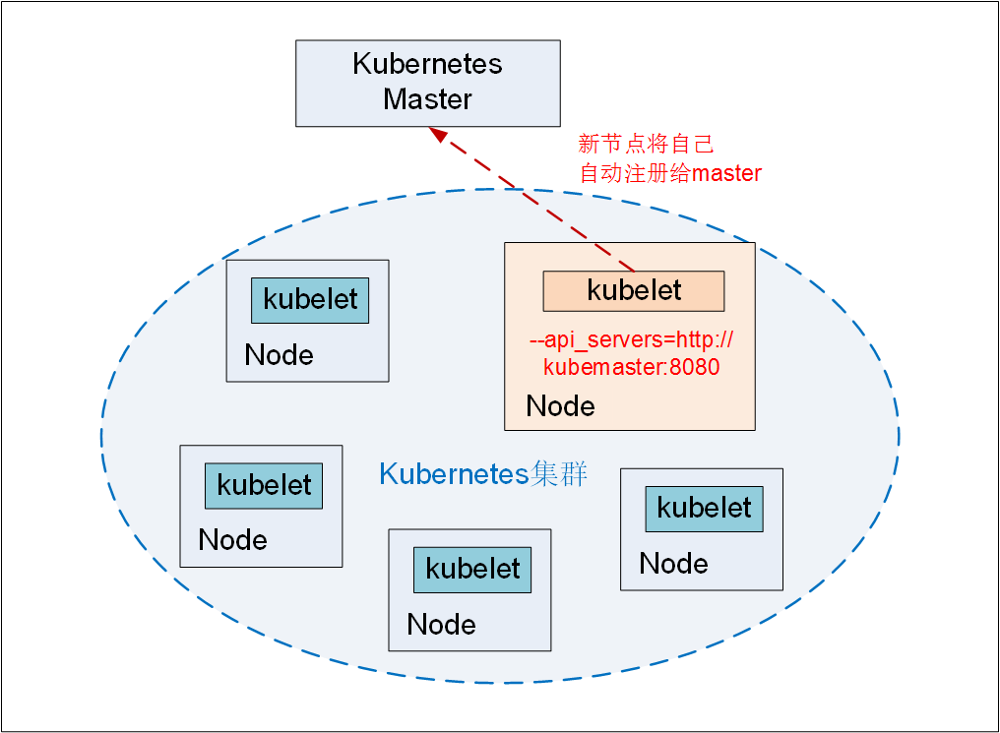

# 3. Kubernetes基本操作 #

## 3.1 常用操作 ##

**1. Node的隔离和恢复**  

在硬件升级、维护等情况下，需要将Node隔离，脱离Kubernetes集群的调度范围。Kubernetes提供了一种机制，可以将Node纳入/脱离调度范围。有以下两种方法可以实现：

- 创建配置文件：unschedule_node.yaml，将spec.unschedulable设置为true。
		
		//unschedule_node.yaml
		apiVersion: v1
		kind: Node
		metadata:
		  name: kubernetes-minion1
		  labels:
		    kubernetes.io/hostname: kubernetes-minion1
		spec:
		  unschedulable: true
- 使用kubectl patch命令完成：

		kubectl patch node <nodename> `{"spec":{"unschedulable":true}}`

>需要注意的是，将某个Node脱离调度范围时，在其上运行的Pod并不会自动停止，管理员需要手动停止在该Node上运行的Pod。 

同样，如果需要将某个Node重新纳入集群调度范围，则将unschedulable设置为false，再次执行kubectl replace或kubectl patch命令就能恢复系统对该Node的调度。 

**2. Node扩容**

- Node节点上安装Docker,Kubelet和kube-proxy服务。
- 配置config文件，将Kubelet和Kube-proxy的启动参数中的Master URL指定为当前Kubernetes集群Master的地址。
- 启动Docker,Kubelet和kube-proxy服务，基于Kubelet的自注册机制，新的Node会自动加入现有的Kubernetes集群中。
- Kubernetes Master将新Node加入集群的调度范围内，容器创建或者Pod可向新的Node调度。

  
图3-1 新节点自动注册完成扩容

**3. Pod动态扩容和缩放**

通过命令`kubectl scale rc`完成Pod动态扩容和缩放，以redis-slave RC为例，初始replicas值为2：
	
	//Pod 扩容
	kubectl scale rc redis-slave --replicas=3
	//Pod 缩减
	kubectl scale rc redis-slave --replicas=2

**4.更新资源对象Lable**  

可以通过kubectl lable命令对label进行增加、修改和删除等操作。相关的命令如下：

	//创建Pod Label
	#  kubectl label pod redis-master-po149 role=backend
	//查看Pod Label
	#  kubect get pods -Lrole
	//修改一个Label，需加上--overwrite参数：
	#  kubectl label pod redis-master-po149 role=master --overwrite
	//删除一个Label
	#  kubectl label pod redis-master-po149 role-
	
**5. 将Pod调度到指定Node**

通过Node的Label和Pod的nodeSelector属性相匹配，从而实现将Pod调度到指定Node，具体的操作如下：

	1. 使用kubectl label命令给目标node打上一个特定的标签, 例如：zone=north
	#  kubectl label node <nodename> <label-key>=<labelvalue>
	
	2. 在Pod配置中加入nodeSelector，以redis-master-controller.yaml为例：
	spec.nodeSelector:
	  <label-key>:<labelvalue>		//zone:north

	3. 创建Pod，Scheduler根据spec.nodeSelector自动调度
	#  kubectl create -f redis-master-controller.yaml

	4. 验证Pod所在Node
	#  kubectl get pods -o wide

这种基于Node标签的调度方式灵活性很高，比如我们可以把一组Node分别贴上“开发环境”“测试验证环境”“用户验收环境”这三组标签中的一种，此时一个Kubernetes集群就承载了3个环境，这将大大提高开发效率。 

> 需要注意的是，如果我们指定了Pod的nodeSelector条件，且集群中不存在包含相应标签的Node时，即使还有其他可供调度的Node，这个Pod也最终会调度失败。 

## 3.2 应用滚动升级--rolling-update ##
当集群中的某个服务需要升级时，我们需要停止目前与该服务相关的所有Pod，然后重新拉取镜像并启动。Kubernetes提供了rolling-update（滚动升级）功能来解决上述问题。

滚动升级通过执行kubectl rolling-update命令一键完成，该命令创建了一个新的RC，然后自动控制旧的RC中的Pod副本数量逐渐减少到0，同时新的RC中的Pod副本数量从0逐步增加到目标值，最终实现了Pod的升级。需要注意的是，系统要求新的RC需要与旧的RC在相同的命名空间（Namespace）内，即不能把别人的资产偷偷转移到自家名下。

以redis-master为例，假设当前运行的redis-master Pod是1.0版本，则现在需要升级到2.0版本。有两种方法可以实现：

- 使用配置文件+kubectl rolling-update命令
- 直接直接用kubectl rolling-update命令

**方法一：使用配置文件+kubectl rolling-update命令**

过程如下：

1. 创建redis-master-controller-v2.yaml的配置文件如下：

		apiVersion: v1
		kind: ReplicationController
		metadata:
		  name: redis-master-v2
		  labels:   
		    name: redis-master
		    version: v2
		spec:
		  replicas: 1
		  selector:
		    name: redis-master
		    version: v2
		  template:
		    metadata:
		      labels:
		        name: redis-master
		        version: v2
		    spec:
		      containers:
		      - name: master
		        image: kubeguide/redis-master:2.0
		        ports:
		        - containerPort: 6379 

2. 运行kubectl rolling-update命令完成Pod的滚动升级

		kubectl rolling-update redis-master -f redis-master-controller-v2.yaml

>在配置文件中有几处需要注意：   
（1）RC的名字（name）不能与旧的RC的名字相同；     
（2）在selector中应至少有一个Label与旧的RC的Label不同，以标识其为新的RC。本例中新增了一个名为version的Label，以与旧的RC进行区分     

**方法二：直接直接用kubectl rolling-update命令**

直接用kubectl rolling-update命令，加上–image参数指定新版镜像名称来完成Pod的滚动升级：

	kubectl rolling-update redis-master --image=redis-master:2.0
与使用配置文件的方式不同，执行的结果是旧的RC被删除，**新的RC仍将使用旧的RC的名字**。Kubectl通过新建一个新版本Pod，停掉一个旧版本Pod，逐步迭代来完成整个RC的更新。

**Pod版本回滚**

如果在更新过程中发现配置有误，则用户可以中断更新操作，并通过执行Kubectl rolling-update –rollback完成Pod版本的回滚：

	kubectl rolling-update redis-master --image=kubeguide/redis-master:2.0 --rollback

