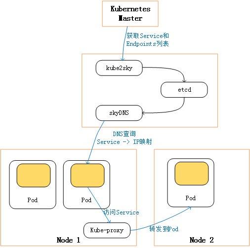

# 6. Kubernetes DNS服务配置案例 #

在Kubernetes系统中，Pod在访问其他Pod的Service时，可以通过两种服务方式完成：

- 环境变量：Service必须在Pod之前被创建出来，然后系统才能在新建的Pod中自动设置与Service相关的环境变量。
- DNS：通过提供了全局的DNS服务器实现服务的注册与发现。

Kubernetes提供的DNS由以下三个组件组成：

- etcd：DNS存储。
- kube2sky：将KUbernetes Master中的Service注册到etcd。
- skyDNS: 提供DNS域名（Service Name）解析服务，ServiceName-->Cluster IP。

这三个组件以Pod的方式启动和运行。所以在一个Kubernetes集群中，它们可能被调度到任意一个Node上去。为实现各组件之间网络互通，需将不同Pod之间的网络打通（flannel等方式）。

## 6.1 Kubernetes DNS配置过程 ##

**1. 编写skydns ReplicationController和Service配置文件**

skydns-rc.yaml和skydns-svc.yaml已上传至GiltLab。

其中需要修改的参数说明如下：

- kube2sky设置参数`--kube_master_url=http://172.21.101.102:8080`，用于kube2sky访问Master，配置为Master所在的主机和端口号。
- kube2sky设置参数`--domain=cluster.local`，设置kubernetes集群中Service所属域名为cluster.local。启动后，kube2sky会监听Kubernetes，当有新的Service创建时，就会生成相应的记录并保存到etcd中。kube2sky为每个Service生成两条记录：
	- \<service_name>.\<namespace_name>.\<domain>
	- \<service_name>.\<namespace_name>.svc.\<domain>
- skydns的启动参数-addr=0.0.0.0:53表示使用本机TCP和UDP的53端口提供服务。

> 注意，skydns服务使用的clusterIP需要指定一个固定的IP地址，每个Node的Kubelet进程都要使用这个IP地址，不能通过Kunernetes自动分配。且clusterIP地址需要在kube-apiserver启动参数--service-cluster-ip-range指定的IP地址范围内。

**2. 修改每个Node上的Kubelet的启动参数**

修改/etc/kubernetes/kunelet配置文件，并添加kubelet运行参数KUBELET_ARGS：

	#  vi /etc/kubernetes/kubelet
	   KUBELET_ARGS="--cluster_dns=10.254.0.99 --cluster_domain=cluster.local"

其中：

- --cluster_dns=10.254.0.99，指定KubernetesDNS服务的ClusterIP地址。
- --cluster_domain=cluster.local，指定KubernetesDNS服务的域名。

然后重启kubelet服务进程。

**3. 创建skydns Pod和Service**

通过kubectl create完成RC和Service的创建：

	#  kubectl create -f skydns-rc.yaml
	#  kubectl create -f skydns-svc.yaml

查看skydns相关的RC、Pod、Service是否创建：

	#  kubectl get rc --namespace=kube-system
	#  kubectl get pods --namespace=kube-system
	#  kubectl get services --namespace=kube-system

## 6.2 验证Kubernetes的DNS服务正常工作 ##

使用一个带有nslookup工具的pod（busybox或healthz等）来验证DNS服务能否正常工作。此处采用busybox的Pod。

**1. 创建busybox的Pod**

编写配置文件busybox.yaml，并通过kubectl完成busybox的Pod创建：

	#  kubectl create -f busybox.yaml

**2. kubectl exec测试**

busybox Pod的容器启动成功后，可通过以下命令进行测试：

	#  kubectl exec <container_id> nslookup <service_name> <dns_server>

default命名空间的dns测试：

	#  kubectl create -f redis-master-service.yaml //ServiceName:redis-master
	#  kubectl exec busybox -- nslookup redis-master
		Server:    10.254.0.3
		Address 1: 10.254.0.3
		Name:      redis-master
		Address 1: 10.254.7.160

自定义命名空间的dns测试：

	#  kubectl exec busybox -- nslookup kube-dns.kube-system

查看多个容器组成的Pod时，要添加-c选项指定容器的名称

	# kubectl logs kube-dns-v9-curdr -c skydns --namespace=kube-system

## 6.3 Kubernetes DNS服务的工作原理 ##

**1. kube2sky容器应用通过调用Kubernetes Master的API获得集群中的所有Service的信息，并持续监控新Service的生成，然后写入etcd中。**

- 查看etcd存储的Service信息，可以看出skydns下面根据配置的域名(cluster.local)生成了svc/pod-->namespace(default/kube-system)-->ServiceName(redis-master)-->ServicID-->ClusterIP等信息：
		
		#  kubectl exec kube-dns-v11-fo8zi -c etcd --namespace=kube-system etcdctl ls /skydns/local/cluster
		#  kubectl exec kube-dns-v11-fo8zi -c etcd --namespace=kube-system etcdctl ls /skydns/local/cluster/svc/
		#  kubectl exec kube-dns-v11-fo8zi -c etcd --namespace=kube-system etcdctl ls /skydns/local/cluster/svc/default

		# kubectl exec kube-dns-v11-fo8zi -c etcd --namespace=kube-system etcdctl get /skydns/local/cluster/svc/default/redis-master/8d049781
			{"host":"10.254.139.36","priority":10,"weight":10,"ttl":30,"targetstrip":0}

即redis-master服务的完整域名为：redis-master.default.svc.cluster.local,且其IP地址为10.254.139.36

**2. 根据Kubelet启动参数的设置（KUBELET_ARGS='--cluster_dns...'），Kubelet会为每个新创建的Pod中设置DNS域名解析配置文件`/etc/resolv.conf`，在其中增加一条nameserver配置和一条search配置：**

	#  kubectl exec busybox cat /etc/resolv.conf
	search default.svc.cluster.local svc.cluster.local cluster.local
	nameserver 10.254.0.99
	options ndots:5

**3. 应用程序可通过服务名称访问服务（ServiceName-->ClusterIP）。**

> 通过DNS设置，对于其他Service的查询将可以不再依赖系统为每个Pod创建的环境变量，而是直接使用Service的名字就能对其访问，使得应用程序中的代码更加简洁。