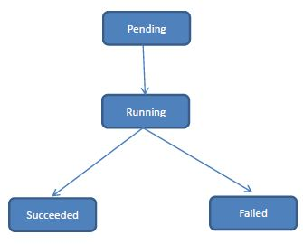
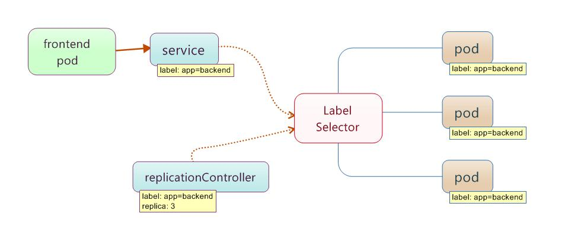

# 1. Kubernetes基础 #

## 1.1 主要用途和特性 ##

Kubernetes（k8s）可以看做是谷歌严格保密十几年的秘密武器---Borg的一个开源版本。Borg是谷歌一个久负盛名的内部使用的大规模集群管理系统，基于容器技术实现资源管理的自动化及跨数据中心资源利用最大化。Kubernetes是自动化容器操作的开源集群管理平台，可以实现容器部署、调度和节点集群间扩展等操作。Docker是Kubernetes内部使用的低级别组件，Kubernetes不仅仅支持Docker，还支持Rocket。

Kubernetes有以下特性：

- 自动化容器的部署和复制
- 随时扩展或收缩容器规模
- 将容器组织成组，并且提供容器间的负载均衡
- 很容易地升级应用程序容器的新版本
- 提供容器弹性，如果容器失效就替换它
- 资源配额管理，确保指定对象在任何时候都不会超量占用系统资源
- 高可用（HA）
- 集群监控
- ...

实际上，使用Kubernetes只需一个部署文件，一条命令就可以部署多层容器（前端，后台等）的完整集群：

	$ kubectl create -f single-config-file.yaml

kubectl是和Kubernetes API交互的命令行程序。现在介绍一些核心概念。

## 1.2 基本概念 ##
Kubernetes中，Node、Pod、Replication Controller、Service等概念都可以看做一种资源对象，通过Kubernetes提供的kubectl工具或者API调用进行操作，并保存在etcd中。
### 1.2.1 Cluster--集群 ###

集群是一组节点，这些节点可以是物理服务器或者虚拟机，之上安装了Kubernetes组件。典型的Kubernetes架构图如下图所示，注意该图为了强调核心概念有所简化，但是逻辑关系更清晰。

上图可以看到以下KUbernetes组件，使用特别的图标表示Service和Label：

- Kubernetes Master（Kubernetes主节点）
- Node（节点）
- Pod
- Container（容器）
- Label()（标签）
- Replication Controller（复制控制器）
- Service（）（服务）

### 1.2.2 Node ###
Node是Kubernetes集群中相对于Master而言的主机，在较早版本中被称作Minion。在Node上运行的而服务进程包括Kubelet、kube-proxy和docker daemon。

**Node的信息**如下：

- Node地址： 主机的IP地址或者Node ID
- Node运行状态：包括Pending、Running、Terminated三种状态。
- Node Condition:描述Running状态Node的运行条件，目前只有一种条件--Ready,表示Node处于健康状态，可以接收从Master发来的创建Pod的指令。
- Node 系统容量：描述Node可用的系统资源，包括CPU、内存数量、最大可调度Pod数量等。
- 其它信息：Kuebrnetes/Docker版本号、操作系统信息等...

**查看node详细信息示例：**

	kubectl get nodes
	kubectl describe node <nodename>
**Node的管理：**Kubernetes只是创建node对象，然后对其进行一系列健康检查，包括可以是否可以连通、是否可以创建Pod等。若检查未能通过，则标记为不可用(Not Ready)。可使用NodeController实现集群范围内Node信息的同步及单个Node的生命周期管理。

**Node自注册：**通过kubelet进程启动参数配置实现自注册，需指定参数如下：
	
	- --apiserver=:apiserver的地址
	- --register-node=: true
	-  ...
 
kubelet会向apiserver注册自己。自注册是Kubernetes推荐的Node管理方式。

### 1.2.3 Pod ###
Pod是Kubernetes的最基本的操作单元，包含一个或多个紧密相关的容器。Pod在Node上被创建、启动或者销毁。**一个Pod中的多个应用容器通常是紧密耦合的，并且共享一组资源**：

- PID Namespace：Pod中的不同应用程序可以看到其他应用程序的进程PID。
- Network Namespace：Pod中的多个容器能够访问同一个IP和端口范围，IP per Pod。
- UTS Namespace：Pod中的多个容器共享一个主机名。
- Volumes（共享存储卷）：Pod中的各个容器可以访问在Pod级别定义的Volumes。

**Pod定义**：Pod定义通过Yaml或json格式的配置文件完成，其中kind为Pod,spec中包含了对Containers的定义，可以定义多个容器。简单的pod定义文件如下所示：

	//redis-slave-pod.yaml
	apiVersion: v1
	kind: Pod
	metadata:
	  name: redis-slave
	  labels: 
		name: redis-slave
	spec:  # specification of the pod's contents
	  restartPolicy: Never
	  containers:
	  - name: slave
        image: kubeguide/guestbook-redis-slave
        ports:
        - containerPort: 6379
        env:
        - name: GET_HOSTS_FROM
          value: env

**Pod的生命周期：**通过ymal/json模板定义-->分配到Node上运行-->Pod所含容器运行结束后Pod也结束。  
整个过程Pod处于以下四种状态之一：

- Pending：Pod定义正确，提交至Master，但是容器还未完全创建（Pod调度、镜像下载/运行等耗时）。
- Running：Pod已被分配到某个Node上，且其包含的所有Container镜像均已创建完成并正确运行。
- Succeeded：Pod中所有容器都成功结束，且不会被重启，这是Pod的一种最终状态。
- Failed：Pod中所有容器都结束可，但至少有一个容器是以失败结束的。这也是Pod的一种最终状态。

### 1.2.4 Lable ###

Label()是KUbernetes系统中的核心概念，其本质是attach到各种对象（如Pod、Servcie、RC、Node等）上的键/值对，用来传递用户定义的属性。比如，可以创建一个"tier"和“app”标签，通过Label（tier=frontend, app=myapp）来标记前端Pod容器，使用Label（tier=backend, app=myapp）标记后台Pod。然后可以使用Selectors选择带有特定Label的Pod，并且将Service或者Replication Controller应用到上面。

**Label选择器**有两种，分别是:

- **Equality-based选择器**

		#Equality-based Label selector
		#匹配Label具有environment key且等于production的对象
		environment = production 
		#匹配具有tier key，但是值不等于frontend的对象
		tier != frontend 
		#kubernetes使用AND逻辑，第三条匹配production但不是frontend的对象。
		environment = production，tier != frontend 
- **Set-based选择器**

		#Set-based Label selector
		#选择具有environment key，而且值是production或者qa的label附加的对象
		environment in (production, qa)
		#选择具有tier key，但是其值不是frontend和backend
		tier notin (frontend, backend)
		#选则具有partition key的对象，不对value进行校验
		partition

> 使用Label可以给对象创建多组标签，Service、RC等组件则通过Label Selector来选择对象范围。Label和Label Selector共同构成了Kubernetes系统中最核心的应用模型，使得被管理对象能够被精确地分组管理。

### 1.2.5 Replication Controller ###

Replication用于解决以下几个问题：

- 是否手动创建Pod？
- 如果想要创建同一个容器的多份拷贝，需要一个个分别创建出来么？
- 能否将Pods划到逻辑组里？

**Replication Controller定义**

当创建Replication Controller时，需要指定以下内容：

- Pod模板（spec.template）：用来创建Pod副本的模板。
- Label(spec.selector):Replication Controller需要监控的Pod的标签。
- spec.replicas:创建的pod副本的数量。

一个简单的Replication Controller定义模板文件实例如下：

	//redis-slave-controller.yaml
	apiVersion: v1
	kind: ReplicationController  //定义类型：ReplicationController
	metadata:
	  name: redis-slave
	  labels:
	    name: redis-slave
	spec:
	  replicas: 3   //创建的pod副本的数量
	  selector:
	    name: redis-slave  //Replication Controller需要监控标签为“name = redis-slave”Label的Pod
	  template:     //Pod 副本模板定义                 
	    metadata:  //Pod的元数据
	      labels:
	        name: redis-slave
	    spec:
	      containers:   //Pod内运行的容器信息
	      - name: slave
	        image: kubeguide/guestbook-redis-slave  //容器镜像
	        ports:
	        - containerPort: 6379
	        env:
	        - name: GET_HOSTS_FROM
	          value: env

Replication Controller确保任意时间都有指定数量（spec.replicas）的Pod“副本”在运行。如果为某个Pod创建了Replication Controller并且指定3个副本，它会创建3个Pod，并且持续监控它们。如果某个Pod不响应，那么Replication Controller会替换它，保持总数为3.如下面的动画所示：

如果之前不响应的Pod恢复了，现在就有4个Pod了，那么Replication Controller会将其中一个终止保持总数为3。如果在运行中将副本总数改为5，Replication Controller会立刻启动2个新Pod，保证总数为5。还可以按照这样的方式缩小Pod。

**Replication Controller主要功能：**

- **Rescheduling**： Replication Controller会确保Kubernetes集群中指定的pod副本(replicas)在运行， 即使在节点出错时。
- **Scaling**： 通过修改Replication Controller的副本(replicas)数量来水平扩展或者缩小运行的pods。
- **Rolling updates**：Replication Controller的设计原则使得可以一个一个地替换pods来滚动更新服务。

### 1.2.6 Service ###

Kubernetes中Replication Controller可以现在已经创建多个Pod的replicas，而且每个Pod都会被分配一个IP地址,但是IP地址会随着Pod的销毁而消失。在此背景下，Service提出用于解决以下问题：

- 如果有一组Pod组成一个集群来提供服务，那么如何访问这些Pods？
- 在这些Pod副本上如何均衡负载呢？

一个Service可以看做一组提供相同服务的Pod的对外访问接口。Service作用于哪些Pods是通过Label Selector定义的。

**Service 定义**  
Service的定义亦使用Yaml或Json格式的配置文件完成。以redis-slave服务的定义为例：

	//redis-slave-service.yaml
	apiVersion: v1
	kind: Service //定义类型：Service
	metadata:
	  name: redis-slave
	  labels:
	    name: redis-slave
	spec:
	  selector:
	    name: redis-slave  //选择具有“name = redis-slave”Label的Pod
	  ports:
	  - port: 6379  //容器监听的端口号
通过该定义，Kubernetes会创建一个名为“redis-slave”的服务，spec.selector的定义表示该Service会选择具有“name = redis-slave”Label的Pod。

**自动创建Endpoints**：  

Kubernetes会根据Service的定义创建出与Pod同名的Endpoint对象，以建立起Service与后端Pod的对应关系。Endpoint对象主要由Pod的IP地址和容器需要监听的端口号列表组成，通过`kubectl get endpoints`命令可以查看，显示为IP:port格式。（kube-proxy就是从Endpoint列表中选择服务后端Pod的）。

**Pod的IP地址和Service的Cluster IP地址**  

- Pod的IP地址：Docker Daemon根据docker0网桥的IP 地址段（`--bip=...`）进行分配
- Service的Cluster IP地址：Kubernetes系统中的虚拟IP地址，由系统动态分配。

Service的Cluster IP地址比Pod的IP地址相对稳定：

- Service创建时即分配一个 Cluster IP地址，在销毁该Service之前，Cluster IP地址均不会变化。
- Pod生命周期较短，销毁后再次创建会分配一个新的Pod IP地址。

 **内部访问Service**：

Kubernetes在一个集群内创建的对象或者在代理集群节点上发出访问的客户端我们称之为**内部使用者**。要把服务暴露给内部使用者，Kubernetes支持两种方式：环境变量和DNS。

- **环境变量**：当kubelet在该Pod的所有容器中为当前运行的Service设置一系列环境变量，这样Pod就可以通过环境变量访问这些Service了。 不常用。
- **DNS**：通过Service name找到Service，DNS返回的查找结果是Cluser IP，并通过Cluster访问后端Pod（kube-proxy实现，后面介绍）。推荐使用。

下述动画展示了Service的功能。

**外部访问Service**：

Kubernetes支持两种对外服务的Service的type定义：Nodeport和LoadBalancer，通过spec.type指定。

- **NodePort**：在定义Service时指定spec.type=NodePort，并指定spec.ports.nodePort的值，系统就会在Kubernetes的集群中的每个Node上打开一个主机的真实端口号。能够访问Node的外部客户端均可通过访问spec.ports.nodePort指定的端口号访问到集群内部的Service。
以phpfrontend为例,其定义文件如下：

		//php-frontend-service.yml
		apiVersion: v1
		kind: Service   
		metadata:
		  name: frontend
		  labels:
		    name: frontend
		spec:
		  selector:
		    name: frontend
		  type: NodePort  //指定对外服务类型为NodePort方式
		  ports:
		  - port: 80
		    nodePort: 30001 //指定Node打开的真实端口。
	>若php-frontend Pod运行在多个主机上，则可以通过其中任意一个主机访问该php-frontend Service,访问方式为：NodeIP:nodePort

- **LoadBalancer**：定义Service时指定spec.type=LoadBalancer，同时需要指定LoadBalancer的IP地址。使用LoadBalance需同时指定Service的nodePort和cluserIP。之后，该Service的访问请求将会通过LoadBalancer转发到后端Pod上去。

		//loadbalancer.json	
		{
		    	"kind": "Service",
			    "apiVersion": "v1",
			    "metadata": {
			        "name": "my-service"
				    },
			    "spec": {
			        "selector": {
		            "app": "MyApp"
		        	},
		        	"ports": [
		            	{
		               	 	"protocol": "TCP",
		               	 	"port": 80,                  //service port
		               	 	"targetPort": 9376,         //pod中某个容器的Port
		                	"nodePort": 30061           //指定nodePort
		            	}
		        	],
		        	"clusterIP": "10.0.171.239",        //指定clusterIP
		        	"type": "LoadBalancer"             //指定对外服务类型为LoadBalancer方式            
		    	},
		    	"status": {
		        	"loadBalancer": {
		            	"ingress": [
		                	{
		                    	"ip": "146.148.47.155"  //指定LoadBalancer的IP地址
		                	}
		            	]
		        	}
		    	}
			}

## 1.3 基本组件构成及功用 ##
Kubenetes整体框架如下图，Kubernetes集群中的主机按功能划分为Master节点和Node节点，并根据其职责运行不同的Kubernetes组件。

下图是官方给出的完整的架构图：

**master**运行三个组件：

- **apiserver：**作为kubernetes系统的入口，封装了核心对象的增删改查操作，以RESTFul接口方式提供给外部客户和内部组件调用。它维护的REST对象将持久化到etcd（一个分布式强一致性的key/value存储）。
- **scheduler：**负责集群的资源调度，为新建的pod分配机器。这部分工作分出来变成一个组件，意味着可以很方便地替换成其他的调度器（plug-in）。
- **controller-manager：**负责执行各种控制器。   
	- **replication-controller：**定期关联replicationController和pod，保证replicationController定义的复制数量与实际运行pod的数量总是一致的。  
	- Node-Controller, Service-Controller,endpoint-controller,ResourceQuota-Controller,NameSpace-Controller,ServiceAccount-Controller...

**Node**(称作minion)运行两个组件：

- **kubelet：**负责管控docker容器，如启动/停止、监控运行状态等。它会定期从etcd获取分配到本机的pod，并根据pod信息启动或停止相应的容器。同时，它也会接收apiserver的HTTP请求，汇报pod的运行状态。
- **proxy：**负责为pod提供代理。它会定期从etcd获取所有的service，并根据service信息创建代理。当某个客户pod要访问其他pod时，访问请求会经过本机proxy做转发。

### 1.3.1 API Server ###

### 1.3.2 Scheduler ###

### 1.3.3 controller-manager ###

### 1.3.4 Kubelet ###

## 1.4 工作方式 ##
## 1.5 基本安装步骤 ##
## 1.6 使用演示 ##