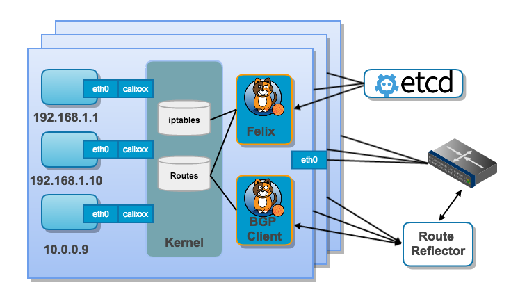

# 2. Kubernetes进阶 #

## 2.1 Kubernetes基本概念扩展 ##

Kubernetes管理的基本单元是Pod。下面详细介绍Kubernetes管理Pod的几种方式。

### 2.1.1 Deployment ###

Deployment用于Pod和Replica Set的Update。可以在Deployment配置文件中描述一种预期状态，Deployment Controller会以可控的速率修正当前状态为预期状态(功能和Replication Controller类似)。使用Deployment可以创建新的资源对象或替换现有资源对象。

Deployment的典型应用场景如下：

- 通过创建Deployment来运行Replica Set和Pods: `kuebctl get rs/pods`
- 检查Deployment状态： `kubectl rollout status deployment/nginx-deployment`
- Pod升级（Deployment update）,例如使用新的image:` kubectl set image deployment/nginx-deployment nginx=nginx:1.9.1`
- Pod版本回滚: `kubectl rollout undo deployment/nginx-deployment --to-revision=2`
- Deployment暂停或重启: `kubectl rollout pause/resume deployment/nginx-deployment `

创建Deployment配置文件，其Selector与Replica Set写法一致，区别Replication Controller。

	##nginx-deployment.yaml
	apiVersion: extensions/v1beta1
	kind: Deployment
	metadata:
	  name: nginx-deployment
	spec:
	  replicas: 2
	  selector:      # 指定Pod Selector
	    matchLabels:  # equality-based selector
	      run: nginx-deployment
        matchExpressions:   # Set-based selector
	      - {key: run, operator: In, values: [nginx-deployment]}
	  template:
	    metadata:
	      labels:
	        run: my-nginx
	    spec:
	      containers:
	      - name: my-nginx
	        image: library/nginx:1.9
	        ports:
	        - containerPort: 80

### 2.1.2 Replica Set ###

Replica Set是下一代Replication Controller。现有版本的Replica Set和eplication Controller的区别为标签选择器Selector的支持：

- Replica Set 同时支持 set-based selector和equality-based selector。
- Replication Controller只支持 equality-based selector。

Relica Set保证在指定时间内有指定数量的Pod Replicas运行。然而Deployment是更高层次的概念，用于管理Replica Sets，提供Pod的升级及其它有用的特性。因此，建议使用Deployment，一般不必直接使用Replicat Set。

Replica Set配置文件实例：

	apiVersion: extensions/v1beta1  # 指定Replica Set使用的APIVersion
	kind: ReplicaSet         # 指定kind为ReplicaSet
	metadata:                #  ReplicaSet元数据
	  name: frontend
	  labels:
	    app: guestbook
	    tier: frontend
	spec:       #  ReplicaSet详细信息
	  replicas: 3   # 指定Pod副本的个数
	  selector:      # 指定Pod Selector
	    matchLabels:  # equality-based selector
	      tier: frontend
	    matchExpressions:   # Set-based selector
	      - {key: tier, operator: In, values: [frontend]}
	  template: #Pod模板
	    metadata:
	      labels:
	        app: guestbook
	        tier: frontend
	    spec:
	      containers:
	      - name: php-redis
	        image: gcr.io/google_samples/gb-frontend:v3
	      ...

### 2.1.3 Daemon Sets(守护进程集) ###

Daemon Set确保Kubernetes集群中所有Node（或部分Node）上都运行一个Pod--One Pod per Node。

- 添加Nodes，Daemon Set指定的Pods会自动在添加的Nodes上运行。
- 删除Nodes，Daemon Set指定的Pods会自动实现Pods的垃圾回收。
- 删除Daemon Set，其创建的所有Pods均会被删除。

典型的DeamonSet使用场景如下：

- 在每台Node上运行一个cluster存储进程，如glusterd, ceph等。
- 在每台Node上运行一个logs收集进程，如fluentd，logstash等。
- 在每台Node上运行一个Node监控进程，如 Prometheus Node Exporter, collectd等。

Daemon 配置文件实例：

	apiVersion: extensions/v1beta1   # 指定DaemonSet使用的APIVersion
	kind: DaemonSet     # 指定kind为DaemonSet
	metadata:         #DaemonSet元数据
	  name: fluentd-elasticsearch-daemonset
	  namespace: kube-system
	  labels:
	    k8s-app: fluentd-logging
	    kubernetes.io/cluster-service: "true"
	spec:  #DaemonSet详细信息
      selector:  # Pod Selector,若指定，需和spec.template.metadata.labels匹配
          - k8s-app: fluentd-logging 
	  template:   #指定Pod模板
	    metadata:  # Pod元数据
	      labels:  #Pod Label
	        k8s-app: fluentd-logging
	        kubernetes.io/cluster-service: "true"
	    spec: # Pod详细信息
	      containers:
	      - name: fluentd-elasticsearch
	        image: google_containers/fluentd-elasticsearch:1.15
          ...
          nodeSelector:  #Running Pods on Only Some Nodes。若不指定nodeSelector，Pod运行在所有Nodes上
            zone:north     ##需要给每个Node打上标签，如指定zone

Daemon Pods的调度：
一般来说，Kubernetes的Pod受Kube-Shceduler进程调度到某个Node上。但是Daemon Pods在创建时，Deamon Controller已经指定了其运行的Node（spec.nodeName），因此：

- 节点Node即使已经设置为`spce. unschedulable=true`，Deamon Pod也会无视，依然会运行在该Node上。
- **即使没有Kube-Scheduler，DaemonSet控制器依然可以创建Pod。此特性可用于cluster bootstrap**。

#### 2.1.4 Pet Sets ####
PetSet的目的是支持有状态和集群化的应用。 PetSet保证在指定时间内运行指定数目的标识唯一的pets。Pet的标识包含：

- 静态的主机名（a stable hostname）, available in DNS
- 一个有序索引（an ordinal index）
- 静态存储 stable storage: linked to the ordinal & hostname

PetSet的应用场景很多，现举例如下：

- 数据库（ MySQL，PostgreSQL等），每个数据库实例都要指定一个NFS持久存储。
- 集群软件（Clustered software），如Zookeeper, Etcd, or Elasticsearch等，需要静态的成员关系。

PetSet中，每个Pod都有唯一的身份，分别包括：名字，网络和存储等，并由组件PetSet Controller负责创建和维护。

**1. Pod名字**

 RC的Pod重启，其Pod名字会改变。PetSet的Pod重启，必须保证名字不变，其通过有序索引实现。 

> PetSet控制器会维护一个identityMap，每一个PetSet中的每个Pod都会拥有一个唯一名字，当Pod重启，PetSet控制器可以感知到是哪个Pod，然后通知API server创建新的同名Pod。感知方法：PetSet控制器维护的identityMap将Pod从0开始进行编号，然后同步的过程就像报数一样，哪个编号不在就重启哪个编号

**2. 存储身份**
存储身份采用PV/PVC实现。创建PetSet时，需要指定分配给Pet的数据卷。

	apiVersion: apps/v1alpha1
	kind: PetSet
	...
	    spec:
 		   ...
	        volumeMounts:
	        - name: www
	          mountPath: /usr/share/nginx/html
	  volumeClaimTemplates:
	  - metadata:
	      name: www
	      annotations:
	        volume.alpha.kubernetes.io/storage-class: anything
	    spec:
	      accessModes: [ "ReadWriteOnce" ]
	      resources:
	        requests:
	          storage: 1Gi

volumeClaimTemplates指定每个Pet需要的存储资源。 目前所有Pet都得到相同大小和类型的数据卷。 当PetSet控制器拿到请求时，会为每一个Pet创建PVC，然后将每个Pet和对应的PVC联系起来。

**3.网络身份**

网络身份主要通过稳定的podname和domain name来维护，他们通过PetSet的配置文件指定，其中metadata.name指定了Pod的hostname前缀（后缀即前面提到的从0开始的索引），spec.ServiceName指定了domain name。

    apiVersion: apps/v1alpha1   #API version
	kind: PetSet   
	metadata:
	  name: web   ##指定hostname
	spec:
	  serviceName: "nginx"  ##指定domain name   
	  replicas: 2
	  template:
	    metadata:
	      labels:
	        app: nginx
	      annotations:
	        pod.alpha.kubernetes.io/initialized: "true"
	    spec:
	      terminationGracePeriodSeconds: 0
	      containers:
	      - name: nginx
	        image: gcr.io/google_containers/nginx-slim:0.8

PetSet利用kubernetes headless service创建PetSet Service。 Headless service不会分配cluster IP来load balance后端的Pod，但会在集群DNS服务器中添加记录：创建者需要自己去利用这些记录。

	# A headless service to create DNS records
	apiVersion: v1
	kind: Service
	metadata:
	  name: nginx
	  labels:
	    app: nginx
	spec:
	  ports:
	  - port: 80
	    name: web
	  # *.nginx.default.svc.cluster.local
	  clusterIP: None    指定None-->headless service 
	  selector:
	    app: nginx

下面是PetSet Cluster Domain, Service name, PetSet name, Pets DNS， Pet Hostname之间关系示例:

| Cluster Domain| Service (ns/name)| PetSet (ns/name) | PetSet Domain | Pet DNS | Pet Hostname
| -----|----| ----|-----|----| ----|
| cluster.local   | default/nginx | default/web	| nginx.default.svc.cluster.local |web-{0..N-1}.nginx.default.svc.cluster.local|web-{0..N-1}
| kube.local   | foo/nginx   |  foo/web   | nginx.foo.svc.kube.local | web-{0..N-1}.nginx.foo.svc.kube.local  | web-{0..N-1}    

访问web-0.nginx.default.svc.cluster.local会返回pod IP，访问nginx.default.svc.cluster.local会返回所有Pet中的pods IP。 一个常见的方式是通过访问domain的方式来获取所有的peers，然后依次和单独的Pod通信。

### 2.1.5 Jobs ###
区别RC和Replica Set,Job通常包含着若干pod的一次性任务。Job通过创建一个或者多个Pods,保证指数目的pods成功结束。Job追踪成功结束的pods的数目，若达到指定数目，则job完成。删除job会删除job创建的所有pods。

Job的配置文件示例如下所示：

	apiVersion: batch/v1
	kind: Job
	metadata:
	  name: pi
	spec:
	  template:
	    metadata:
	      name: pi
	    spec:
	      containers:
	      - name: pi
	        image: perl
	        command: ["perl",  "-Mbignum=bpi", "-wle", "print bpi(2000)"]
	      restartPolicy: Never

**Job类型**

- Non-parallel Jobs
	-  一般只启动一个Pod
	-  Pod成功结束，job完成
- Parallel Jobs with a fixed completion count:
	- 指定`.spec.completions`，对应Parallel Jobs同时进行的个数
	- 若有1~.spec.completions个pods成功结束，则Parallel Jobs完成
- Parallel Jobs with a work queue:
	- 不指定`.spec.completions`，可指定`.spec.parallelism`，或通过`kubectl scale  --replicas=$N jobs/myjob`命令实现scale。
	- Pod之间或者与外部service协调，决定各Pod的职责。
	- 每一个Pod能决定peer pod是否结束，从而决定整个任务是否结束。
	- 若至少一个pod成功结束，且所有的pod均已终止，则job成功结束。
	- 一旦一个pod成功结束，其它pod均停止工作，准备退出。

### 2.1.6 Ingress--服务发现 ###

kubernetes的service的访问类型有三种：

- cluertip，内部访问
- nodeport，外部访问 
- loadbanlance 外部访问，通常需要第三方云服务商提供支持

K8S的Ingress对象提供了另一种服务暴露的方法，通过虚拟主机或者虚拟目录的方式为K8S上的所有HTTP服务提供暴露服务，还能实现 HTTPS、负载均衡、状态统计等功能。Ingress本质上是一组规则的集合，用于外部访问集群内服务。

	internet--> [ Ingress ] -->[ Services ]

Ingress Controller通常和Loadbalancer一起用于执行Ingress的定义规则。
                                
Ingress的配置文件如下所示：
	
	#dashboard-ingress.yaml													   
	apiVersion: extensions/v1beta1
	kind: Ingress
	metadata:
	  name: k8s-dashboard
	  namespace: kube-system
	spec:
	  tls:
	  - hosts:
	    - k8s-dashboard.unionpay.com
	    secretName: k8s-dashboard-secret
	  rules:
	  - host: k8s-dashboard.unionpay.com
	    http:
	      paths:
	      - backend:
	          serviceName: kubernetes-dashboard
	          servicePort: 80
	        path: /

Ingress 配置使用实例：[http://172.17.249.122/qsfang/learnk8s/blob/master/poc/11-kubernetes-NginxIngress.md](http://172.17.249.122/qsfang/learnk8s/blob/master/poc/11-kubernetes-NginxIngress.md)

## 2.2 Kubernetes网络 ##

Docker 网络，参考[http://172.17.249.122/qsfang/learndocker/blob/master/dockerdocs/06-Docker%E7%BD%91%E7%BB%9C%E8%BF%9B%E9%98%B6.md](http://172.17.249.122/qsfang/learndocker/blob/master/dockerdocs/06-Docker%E7%BD%91%E7%BB%9C%E8%BF%9B%E9%98%B6.md)

### 2.2.1 Kubernetes网络模型 ###
Kubernetes网络实现与Docker不同，其需要解决以下四个网络问题：

- 高耦合的Container-to-Container通信：通过Pod和localhost通信实现
- **Pod-to-Pod通信**：本节重点介绍的内容
- Pod-to-Service通信： Service 部分介绍
- External-to-Service通信: Service 部分介绍

Kubernetes的任何网络实现都必须满足以下基本需求：

- 容器间通信不必经过NAT
- 节点和容器间通信不必经过NAT
- 容器自己看到的IP地址和其它容器看到的IP地址一致

实际上,Kubernetes网络基于“IP per Pod”模型，即在每个Pod上分配IP，同一个Pod内的所有容器共享Network Namespace(包括IP地址)。因此，同一Pod内不同容器间的通信可直接通过访问localhost的ports实现。Kubernetes的IP-per-Pod模型基于Docker的container网络模式实现，容器运行时启动参数`--net=container:<CONTAINER ID>`，以加入容器<CONTAINER ID>的网络。

现有许多种网络方案满足Kubernetes的网络需求，本部分详细介绍两种Kubernetes常用的开源网络组件：Flannel和Calico。

### 2.2.2 Flannel ###

**1. Flannel简介**  
Flannel是 CoreOS 团队针对 Kubernetes 设计的一个覆盖网络（Overlay Network）工具，其目的在于帮助每一个使用 Kuberentes 的 CoreOS 主机拥有一个完整的子网。Flannel为Kubernetes提供网络规划服务，简单来说，它的功能是让集群中的不同节点主机创建的Docker容器都具有全集群唯一的虚拟IP地址。

在Kubernetes的网络模型中，假设了每个物理节点应该具备一段“属于同一个内网IP段内”的“专用的子网IP”。例如：

	节点A：10.0.1.0/24
	节点B：10.0.2.0/24
	节点C：10.0.3.0/24

但在默认的Docker配置中，每个节点上的Docker服务会分别负责所在节点容器的IP分配。这样导致的一个问题是，不同节点上容器可能获得相同的内网IP地址。并使这些容器之间能够之间通过IP地址相互找到，也就是相互ping通。

Flannel的设计目的就是为集群中的所有节点重新规划IP地址的使用规则，从而使得不同节点上的容器能够获得“同属一个内网”且”不重复的”IP地址，并让属于不同节点上的容器能够直接通过内网IP通信。

**2. Flannel工作原理**  
Flannel实质上是一种“覆盖网络(overlay network)”，也就是将TCP数据包装在另一种网络包里面进行路由转发和通信，目前已经支持UDP、VxLAN、AWS VPC和GCE路由等数据转发方式。默认的节点间数据通信方式是UDP转发。
 

图2-1 Flannel网络架构

Flannel框架如图2-1所示，数据从源容器中发出后，经由所在主机的docker0虚拟网卡转发到flannel0虚拟网卡，这是个P2P的虚拟网卡，flanneld服务监听在网卡的另外一端。

源主机的flanneld服务将原本的数据内容UDP封装后根据自己的路由表投递给目的节点的flanneld服务，数据到达以后被解包，然后直接进入目的节点的flannel0虚拟网卡，然后被转发到目的主机的docker0虚拟网卡，最后就像本机容器通信一样经docker0路由到达目标容器。

Flannel通过Etcd服务维护了一张节点间的路由表，Flannel通过Etcd分配了每个节点可用的IP地址段后，修改了Docker的启动参数（“--bip=172.17.18.1/24”这个参数，它限制了所在节点容器获得的IP范围）。IP范围是由Flannel自动分配的，由Flannel通过保存在Etcd服务中的记录确保它们不会重复。 **IP分配还是Docker在做，Flannel只是分配了子网。** 

**3. Flanne安装配置**

详细参考Kubernetes安装指南[http://172.17.249.122/qsfang/learnk8s/blob/master/poc/01-Kubernetes-InstallGuide-CentOS7.2.md](http://172.17.249.122/qsfang/learnk8s/blob/master/poc/01-Kubernetes-InstallGuide-CentOS7.2.md)

### 2.2.3 Calico

**1. Calico简介**  
Calico是一个纯3层的数据中心网络方案，而且无缝集成像OpenStack这种IaaS云架构，能够提供可控的VM、容器、裸机之间的IP通信。

通过将整个互联网的可扩展IP网络原则压缩到数据中心级别，Calico在每一个计算节点利用Linux Kernel实现了一个高效的vRouter来负责数据转发，而每个vRouter通过BGP协议负责把自己上运行的workload的路由信息像整个Calico网络内传播——小规模部署可以直接互联，大规模下可通过指定的BGP route reflector来完成。这样保证最终所有的workload之间的数据流量都是通过IP路由的方式完成互联的。

图2-2 Calico workload路由信息传播示意图  
Calico节点组网可以直接利用数据中心的网络结构（无论是L2或者L3），不需要额外的NAT，隧道或者Overlay Network。如下图所示，这样保证这个方案的简单可控，而且没有封包解包，节约CPU计算资源的同时，提高了整个网络的性能。 

  
图2-3 Calico数据包结构
 
此外，Calico基于iptables还提供了丰富而灵活的网络Policy，保证通过各个节点上的ACLs来提供Workload的多租户隔离、安全组以及其他可达性限制等功能。

**2. Calico框架**

  
图2-4 Calico框架

结合图2-4，Calico的核心组件如下：

- **Felix：**Calico Agent，跑在每台需要运行Workload的节点上，主要负责配置路由及ACLs等信息来确保Endpoint的连通状态；
- **etcd：**分布式键值存储，主要负责网络元数据一致性，确保Calico网络状态的准确性；
- **BGP Client（BIRD）：** 主要负责把Felix写入Kernel的路由信息分发到当前Calico网络，确保Workload间的通信的有效性；
- **BGP Route Reflector（BIRD）：**大规模部署时使用，摒弃所有节点互联的 mesh 模式，通过一个或者多个BGP Route Reflector来完成集中式的路由分发；

**3. Calico Network核心概念**  

- **Network Controller**：对外提供分配及管理网络的APIs。
- **Driver：**Driver（包括IPAM）负责一个Network的管理，包括资源分配和回收。

Calico的两个网络概念：

- **Pool**：定义可用于Docker Network的IP资源范围，比如：10.0.0.0/8或者192.168.0.0/16；
- **Profile**：定义Docker Network Policy的集合，由tags和rules组成；每个 Profile默认拥有一个和Profile名字相同的Tag，每个Profile可以有多个Tag，以List形式保存。

    	#profile实例
		Inbound rules:
		1 allow from tag WEB 
		2 allow tcp to ports 80,443
		Outbound rules:
		1 allow

  
图2-5 Calico IP路由原理  

**Calico的ACLs Profile主要依靠iptables和ipset来完成，提供的是可针对每个容器级别的规则定义。**

图2-6 Calico 安全策略ACL

**4. Calico安装配置** 

### 2.2.4 Canal  ###

Flannel问题：第一个是要做封包的操作。第二个问题是每个主机上的容器是固定的，容器的不同主机之前的迁移必然带来IP的变化。

### 2.2.5 NetworkPolicy 

- Namespace级别的隔离策略
- network policy是一种Pod选择方式的描述，用于允许Pod之间及其与network endpoints之间的访问
- network policy通过label选择允许访问的Pods（白名单），允许流量达到label指定的Pod
- network policy需要calico-policy-controller控制器实现。

## 2.3 Kubernetes集群性能监控 ##

## 2.4 Kubernetes集群日志管理 ##